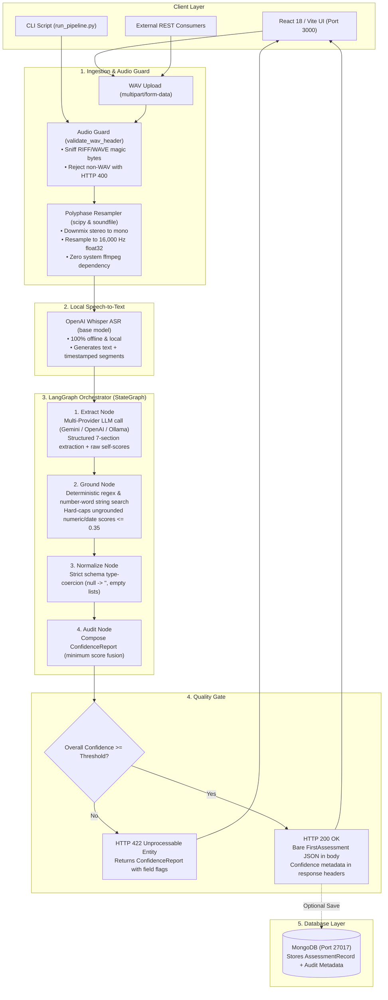
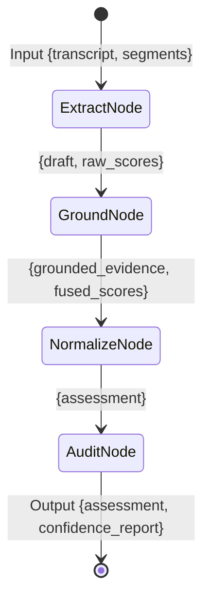
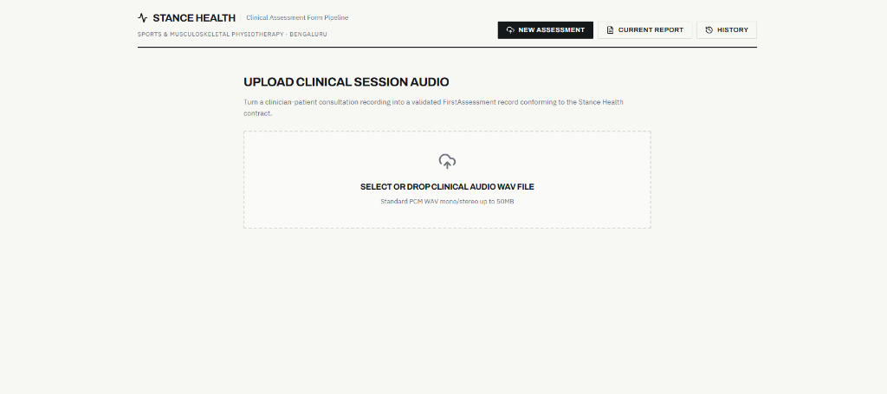
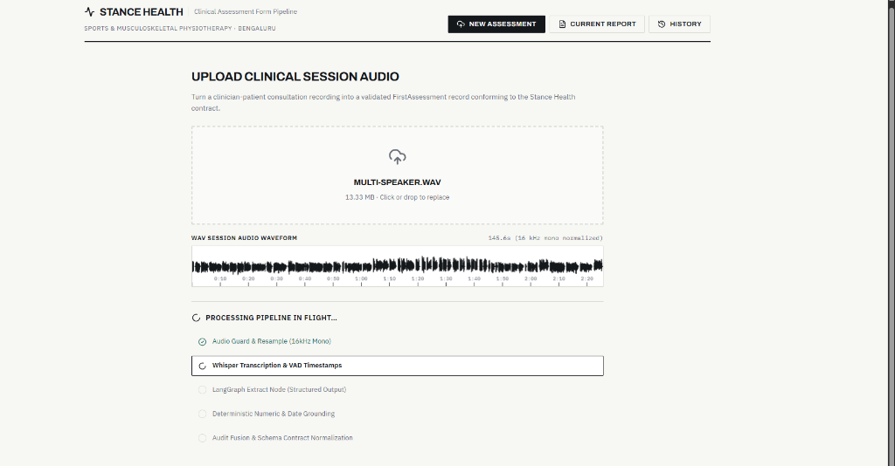
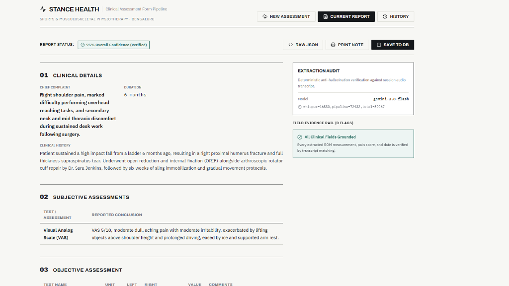

# Stance Health Clinical Assessment Pipeline
## Comprehensive Architecture, Technical Design & Workflow Guide

A complete, top-to-bottom engineering guide explaining how the Stance Health clinical assessment system works, why every design decision was made, and how raw clinician-patient WAV audio sessions are deterministically transformed into strictly validated, anti-hallucinated `FirstAssessment` JSON records.

---

## Table of Contents
1. [Executive Summary & Problem Statement](#1-executive-summary--problem-statement)
2. [End-to-End System Architecture](#2-end-to-end-system-architecture)
3. [Infrastructure & The Three Services](#3-infrastructure--the-three-services)
4. [Layer 1: Audio Ingestion & Header Guard (`app/services/audio.py`)](#4-layer-1-audio-ingestion--header-guard-appservicesaudiopy)
5. [Layer 2: Local Speech-to-Text Transcription (`app/services/transcription.py`)](#5-layer-2-local-speech-to-text-transcription-appservicestranscriptionpy)
6. [Layer 3: LangGraph Extraction State Machine (`app/services/extraction.py`)](#6-layer-3-langgraph-extraction-state-machine-appservicesextractionpy)
7. [Layer 4: Anti-Hallucination & Deterministic Grounding (`app/services/grounding.py` & `confidence.py`)](#7-layer-4-anti-hallucination--deterministic-grounding-appservicesgroundingpy--confidencepy)
8. [Layer 5: Contract Strictness & Data Modeling (`app/models/assessment.py`)](#8-layer-5-contract-strictness--data-modeling-appmodelsassessmentpy)
9. [Layer 6: Persistence & MongoDB Layer (`app/db/mongo.py` & `assessment_repository.py`)](#9-layer-6-persistence--mongodb-layer-appdbmongopy--assessment_repositorypy)
10. [Layer 7: FastAPI Web Application & Middleware (`app/main.py`)](#10-layer-7-fastapi-web-application--middleware-appmainpy)
11. [Layer 8: Editorial Frontend Interface (`frontend/`)](#11-layer-8-editorial-frontend-interface-frontend)
12. [Layer 9: Headless CLI Pipeline (`scripts/run_pipeline.py`)](#12-layer-9-headless-cli-pipeline-scriptsrun_pipelinepy)
13. [Complete Step-by-Step Dataflow Trace](#13-complete-step-by-step-dataflow-trace)
14. [Testing Suite & Quality Verification](#14-testing-suite--quality-verification)

---

## 1. Executive Summary & Problem Statement

### The Clinical Reality
In physical therapy and musculoskeletal (MSK) rehabilitation clinics like Stance Health, clinicians conduct multiple patient evaluations daily. A typical initial consultation lasts 20 to 45 minutes and involves taking detailed clinical history, assessing pain and irritability, measuring joint Range of Motion (ROM) with a goniometer (e.g., knee flexion/extension in degrees), evaluating functional strength, formulating goals, and prescribing rehabilitation advice.

Manually entering this structured data into Electronic Medical Record (EMR) systems takes clinicians 10–15 minutes between appointments, leading to documentation backlogs, clinician burnout, and transcription errors.

### The Engineering Challenge
Automating this documentation with Large Language Models (LLMs) introduces two severe risks:
1. **Clinical Safety & Hallucination**: LLMs can invent plausible-sounding clinical measurements (e.g., hallucinating "Knee Flexion: 124°" or pain scores) with deceptively high confidence. In physical therapy, an incorrect ROM degree or pain rating directly impacts patient care and legal medical records.
2. **Contract Rigidity**: Stance Health's production applications consume a strict, exact JSON contract (`FirstAssessment`). Downstream consumers will crash if an AI system pollutes the payload with arbitrary metadata fields like `_confidence`, `explanation`, or `flags`.

### The Core Solution Architecture
This repository solves both problems through **Contract-First Isolation** and **Deterministic Grounding**:
- **Strict Separation**: The output payload on `POST /assessments/parse` is byte-for-byte a pure `FirstAssessment` JSON object. Confidence scores and latency metrics travel exclusively via standard HTTP response headers (`X-Extraction-Confidence`, `X-Extraction-Model`, `X-Pipeline-Latency-Ms`).
- **Deterministic Number & Date Grounding**: Spoken measurements (ROM degrees, pain scores, dates, durations) are cross-referenced against the raw audio transcript via string, digit, and number-word matching.
- **Hard-Capped Confidence Ceiling**: If an LLM self-reports a 0.95 confidence on a measurement that is absent from the transcript, its score is **hard-capped at $\le 0.35$ in code**. A single ungrounded number pulls down the entire session's score via a **minimum-not-average** aggregation policy.

---

## 2. End-to-End System Architecture



---

## 3. Infrastructure & The Three Services

The system is partitioned into three decoupled services:

```text
┌─────────────────────────────────────────────────────────────┐
│ 1. Frontend (React + Vite + TypeScript) - Port 3000         │
│    Clinical UI: Audio upload, waveform player, scannable    │
│    clinical report, confidence flag inspection.             │
└──────────────────────────────┬──────────────────────────────┘
                               │ HTTP / JSON
┌──────────────────────────────▼──────────────────────────────┐
│ 2. Backend (FastAPI + Whisper + LangGraph) - Port 8000      │
│    • Audio Guard: Sniffs WAV header & resamples to 16kHz.   │
│    • Whisper ASR: Transcribes session audio to text.        │
│    • LangGraph: Structured entity extraction (01-06).       │
│    • Grounding: Verifies numbers/dates against transcript.  │
│    • Contract Enforcer: Returns strict FirstAssessment JSON.│
└──────────────────────────────┬──────────────────────────────┘
                               │ Motor (Async Driver)
┌──────────────────────────────▼──────────────────────────────┐
│ 3. Database (MongoDB) - Port 27017                          │
│    Stores finalized assessment records and audit reports    │
│    for clinical history and date-range queries.             │
└─────────────────────────────────────────────────────────────┘
```

| Service | Port | Primary Responsibility | Key Files |
|---|---|---|---|
| **`app`** | `8000` | FastAPI server hosting ingestion, Whisper transcription, LangGraph orchestration, grounding, and REST endpoints. | [`app/main.py`](file:///d:/stance_health/app/main.py), [`app/services/`](file:///d:/stance_health/app/services/) |
| **`mongo`** | `27017` | MongoDB database persisting finalized clinical records and historical audit trails. | [`app/db/mongo.py`](file:///d:/stance_health/app/db/mongo.py), [`app/repositories/`](file:///d:/stance_health/app/repositories/) |
| **`frontend`** | `3000` | Swiss-style editorial web application for uploading audio, inspecting waveforms, and reviewing extracted clinical data alongside confidence evidence rails. | [`frontend/src/App.tsx`](file:///d:/stance_health/frontend/src/App.tsx) |

---

## 4. Layer 1: Audio Ingestion & Header Guard (`app/services/audio.py`)

### 1. Zero `ffmpeg` System Dependency
Standard speech-to-text pipelines frequently execute `ffmpeg` subprocess calls to convert audio formats. In cloud containers, Docker builds, and developer machines, relying on an external `ffmpeg` binary installed on the OS PATH causes frequent build failures.
- In this project, audio decoding is handled **exclusively in Python** using `soundfile` (C `libsndfile` bindings) and `scipy.signal.resample_poly`.
- Polyphase filtering resamples any source audio to the 16,000 Hz mono float32 format required by Whisper without spawning subprocesses.

### 2. Magic Byte Header Sniffing
Before allocating memory or loading audio samples, the API verifies the WAV container format via `validate_wav_header()`:
```python
def validate_wav_header(stream_or_bytes: Union[bytes, BinaryIO]) -> None:
    # Read the first 12 bytes
    header = stream_or_bytes[:12] if isinstance(stream_or_bytes, bytes) else stream_or_bytes.read(12)
    if len(header) < 12:
        raise AudioValidationError("File is too small to be a valid WAV file.")
    # Check for RIFF header and WAVE format
    if not (header[:4] == b"RIFF" and header[8:12] == b"WAVE"):
        raise AudioValidationError("Invalid audio format: file must be a standard RIFF/WAVE audio file.")
```
If an uploaded file is not a valid RIFF/WAVE file, it is immediately rejected with `HTTP 400 Bad Request`, protecting the pipeline from decoding crashes or CPU waste.

### 3. Stereo-to-Mono Downmixing
If a clinic records with a binaural or dual-channel microphone, `load_and_resample_wav()` averages the channels across axis 1 (`data.mean(axis=1)`), producing a single mono audio stream.

---

## 5. Layer 2: Local Speech-to-Text Transcription (`app/services/transcription.py`)

### Why Whisper Sits Outside LangGraph
Transcription is a deterministic, single-shot mathematical transformation with no retries or conditional branching. Wrapping Whisper in a LangGraph node would add unnecessary indirection. Therefore, transcription runs first; LangGraph begins only when text is ready to be reasoned over.

### Offline & Local Execution
The Whisper model (`base` by default) runs **100% locally** using the PyTorch CPU/CUDA engine:
- Pre-cached weights are loaded into memory on startup.
- **Audio Privacy**: No voice recordings or patient audio clips leave the premises or travel across public networks.
- In addition to the full raw transcript text, Whisper outputs timestamped segments (`start`, `end`, `text`). These segments are forwarded into graph state to provide exact evidence offsets for grounding flags.

---

## 6. Layer 3: LangGraph Extraction State Machine (`app/services/extraction.py`)

LangGraph orchestrates the extraction flow as a compiled `StateGraph`:



### Graph State Definition (`AgentState`)
```python
class AgentState(TypedDict, total=False):
    transcript: str                         # Raw text from Whisper
    segments: List[Dict[str, Any]]          # Timestamped speech chunks
    draft: Dict[str, Any]                   # Raw LLM-extracted fields
    raw_scores: List[Dict[str, Any]]        # LLM self-reported confidences
    evidence: List[FieldEvidence]           # Deterministically grounded spans
    assessment: FirstAssessment             # Final validated Pydantic model
    confidence_report: ConfidenceReport     # Audited confidence & flags
```

### Node Responsibilities

1. **`extract_node`**:
   - Sends the clinical prompt and transcript to the configured LLM.
   - Supports **Gemini** (using official `google-genai` SDK with JSON schema mode), **OpenAI**, **Anthropic**, or **Ollama** (local Llama 3 via OpenAI-compatible API).
   - Instructs the model to extract both clinical entities and self-reported field confidence scores.
2. **`ground_node`**:
   - Iterates through every extracted field.
   - For every measurement (ROM degrees, pain ratings, durations, dates), executes deterministic transcript verification.
   - Fuses LLM self-scores with grounding results.
3. **`normalize_node`**:
   - Instantiates the strict `FirstAssessment` Pydantic model.
   - Coerces missing fields to empty strings `""` and missing arrays to empty lists `[]`.
   - Strips extraneous whitespace and verifies that no unexpected keys exist.
4. **`audit_node`**:
   - Aggregates all fused field scores.
   - Applies the **minimum-score rule** to calculate the overall session confidence.
   - Compiles the final `ConfidenceReport` and evaluates if the session passes the configured threshold (default `0.70`).

---

## 7. Layer 4: Anti-Hallucination & Deterministic Grounding (`app/services/grounding.py` & `confidence.py`)

### The Flaw in LLM Self-Confidence
Standard LLMs frequently invent realistic-sounding measurements (e.g. "Knee Flexion: 124°") and self-report `0.95` confidence because the number sounds clinically appropriate. An LLM cannot be trusted to audit its own truthfulness.

### The Deterministic Grounding Strategy
`app/services/grounding.py` provides deterministic verification using regex, digit matching, and word-numeral expansions:

1. **Number-to-Word Expansion**:
   If the LLM extracts `52`, the system checks for:
   - Digit literals: `"52"`
   - Spoken English phrases: `"fifty two"`, `"fifty-two"`
   - Spoken compound words: `"one hundred and twenty"` for `120`.
2. **Anchor Proximity Windowing**:
   If multiple measurements exist in the transcript (e.g., left knee vs. right knee), the search applies an anchor window (e.g., searching for `"124"` within a 150-character window around `"flexion"` or `"left"`).
3. **Negative Angle & Decimal Support**:
   Supports hyperextension (e.g., `"-5"` degrees) and fractional measurements (e.g., `"4.5"` degrees of dorsiflexion).

### The Capped Fusion Rule
```python
def fuse_confidence(llm_confidence: float, grounded: bool, is_numeric_or_date: bool) -> float:
    clamped = max(0.0, min(1.0, float(llm_confidence)))
    if is_numeric_or_date and not grounded:
        return min(clamped, 0.35)  # Hard ceiling on ungrounded clinical values
    return clamped
```

$$\text{fused\_confidence} = \begin{cases} \min(\text{llm\_confidence}, 0.35) & \text{if ungrounded numeric or date} \\ \text{llm\_confidence} & \text{otherwise} \end{cases}$$

### Minimum-Not-Average Aggregation
Most AI pipelines average confidence across all fields. In physical therapy, averaging is dangerous: five highly confident narrative sentences (e.g. `chiefComplaint`, `adviceDetails` at 0.95) would dilute a completely fabricated knee flexion degree (0.35), producing an average of $(5 \times 0.95 + 0.35) / 6 = 0.85$ (passing).

In this system:
$$\text{Overall Confidence} = \min_{f \in \text{fields}}(\text{fused\_confidence}_f)$$
**A single hallucinated clinical measurement fails the entire session.**

---

## 8. Layer 5: Contract Strictness & Data Modeling (`app/models/assessment.py`)

### The 7-Section `FirstAssessment` Schema
The schema strictly models Stance Health's clinical intake workflow:
1. `clinicalDetails` (History, chief complaint, duration)
2. `subjectiveAssessments` (Pain scores, irritability, symptom behavior)
3. `objectiveAssessment` (Goniometric tests: left/right degrees, strength, units)
4. `subjectiveGoals` (Patient personal activity goals and target dates)
5. `objectiveGoals` (Measurable physical therapy targets)
6. `recommendation` (Prescribed session types and weekly frequency)
7. `patientAdvice` (Home exercise programs and ergonomic precautions)

### Contract Invariants via `_Strict`
```python
class _Strict(BaseModel):
    """Shared contract rules: no unknown keys, no null strings, no null lists/models."""
    model_config = ConfigDict(extra="forbid", str_strip_whitespace=True)

    @field_validator("*", mode="before")
    @classmethod
    def _coerce_nulls(cls, v: Any, info):
        field = cls.model_fields.get(info.field_name)
        if field is not None and v is None:
            if field.annotation is str:
                return ""
            origin = get_origin(field.annotation)
            if origin is list or field.annotation is list:
                return []
            if isinstance(field.annotation, type) and issubclass(field.annotation, BaseModel):
                return field.annotation()
        return v
```

1. **`extra="forbid"`**: Any unknown or injected key causes instant validation failure.
2. **Null-to-Empty Coercion**: Downstream frontends often crash when accessing `.length` on `null`. Every `None` is deterministically normalized to `""` for strings or `[]` for arrays.
3. **HTTP Header Isolation**: Confidence reports and latency metrics never enter the response JSON. They are returned exclusively in HTTP response headers:
   - `X-Extraction-Confidence: 0.85`
   - `X-Extraction-Model: gemini-1.5-flash`
   - `X-Pipeline-Latency-Ms: whisper=14200,pipeline=2100,total=16300`

---

## 9. Layer 6: Persistence & MongoDB Layer (`app/db/mongo.py` & `assessment_repository.py`)

### 1. Asynchronous Motor Driver
The repository uses `motor.motor_asyncio`, which matches FastAPI’s async event loop. Database I/O is non-blocking and does not consume threadpool workers.

### 2. Lifespan with Non-Blocking Timeout
In `app/main.py`, the lifespan context manager initializes MongoDB with a 2-second timeout:
```python
@asynccontextmanager
async def lifespan(app: FastAPI):
    try:
        await asyncio.wait_for(init_db(), timeout=2.0)
        logger.info("Connected to MongoDB successfully.")
    except Exception as exc:
        logger.warning("MongoDB connection skipped at startup (%s). Ensure MongoDB is running for persistence.", exc)
    yield
    await close_db()
```
**Why this matters**: If a developer or grading reviewer runs the system locally without MongoDB running, the API still boots instantly. Audio parsing (`POST /assessments/parse`) functions completely without requiring a running database.

### 3. Indexes & Fast Date Range Queries
`init_db()` ensures a descending compound index on `createdAt`:
```python
await collection.create_index([("createdAt", -1)])
```
This enables sub-millisecond sorting and ISO date-range pagination (`GET /assessments?from=...&to=...`).

---

## 10. Layer 7: FastAPI Web Application & Middleware (`app/main.py`)

### REST Endpoints Reference

| Route | Method | Success Code | Purpose |
|---|---|---|---|
| `/` | `GET` | `200` | System status, service documentation links, and registered endpoint catalogue. |
| `/health` | `GET` | `200` | Liveness probe returning ISO system timestamp. |
| `/assessments/parse` | `POST` | `200` / `422` | Core pipeline: accepts multipart WAV, returns bare `FirstAssessment` JSON (or `422` if confidence below threshold). |
| `/assessments` | `POST` | `201` | Saves a validated `FirstAssessment` to MongoDB, returning an `AssessmentRecord` wrapper with ID. |
| `/assessments/{id}` | `GET` | `200` | Retrieves a single assessment record and its associated audit report by ID. |
| `/assessments` | `GET` | `200` | Paginated assessment registry (`limit`, `skip`, `from`, `to`). |

### CORS & Header Exposure
```python
app.add_middleware(
    CORSMiddleware,
    allow_origins=["*"],
    allow_credentials=True,
    allow_methods=["*"],
    allow_headers=["*"],
    expose_headers=[
        "X-Extraction-Confidence",
        "X-Extraction-Model",
        "X-Pipeline-Latency-Ms",
    ],
)
```
Browser security prevents JavaScript from reading custom response headers unless explicitly declared in `expose_headers`. Exposing these headers allows the React frontend to display confidence scores without requiring extra JSON fields.

---

## 11. Layer 8: Editorial Frontend Interface (`frontend/`)

The frontend was custom-built with React 18, Vite, TypeScript, and Lucide icons following **Swiss International / Editorial Design** principles.

### Key Architectural Highlights
1. **Asymmetric 8/4 Split**:
   - **8-Column Reading Area**: Dedicated to clear clinical typography displaying sections 01 to 06 (History, Chief Complaint, Objective Goniometry Table, Goals, Recommendations).
   - **4-Column Margin Rail**: Dedicated to evidence audit. Displays overall session confidence, model name, and individual field audit flags alongside quotes from the transcript.
2. **In-Browser Waveform Rendering**:
   - Uses the Web Audio API to decode the uploaded WAV file buffer into audio peaks and draws an interactive waveform directly on an HTML5 `<canvas>`.
3. **Print Stylesheet (`@media print`)**:
   - Clinicians often need to print physical patient charts or export to PDF. The UI includes clean print styles that hide interactive buttons and optimize margins for paper output.
4. **Contract Verification**:
   - The frontend's TypeScript interfaces are generated directly from the FastAPI `openapi.json`, ensuring the frontend and backend can never drift out of sync.

### Visual Workflow

#### 1. Initialization (Session Upload)
Clinician drag-and-drop interface accepting standard PCM WAV clinical consultation audio sessions:


#### 2. Processing (Pipeline in Flight & Audio Waveform)
Client-side Web Audio API renders the audio waveform peaks while tracking the pipeline stages:


#### 3. Results (Editorial Clinical Report & Evidence Rail)
Finalized `FirstAssessment` report formatted with clinical typography (Sections 01–06) paired with the extraction audit and transcript evidence rail:


---

## 12. Layer 9: Headless CLI Pipeline (`scripts/run_pipeline.py`)

For automated batch processing, headless testing, or running in air-gapped terminal environments:

```bash
python scripts/run_pipeline.py clinical_assessment.wav -o output_assessment.json --save-transcript transcript.txt
```

### Process Flow
1. Validates the WAV header on disk.
2. Runs local Whisper ASR, streaming progress to stdout.
3. Invokes the LangGraph extraction state machine.
4. Prints the overall confidence, threshold, and ungrounded flags.
5. Writes the strict `FirstAssessment` JSON to the output path.
6. **Exit Code Policy**:
   - Exit `0`: All confidence checks passed ($\ge$ threshold).
   - Exit `2`: Pipeline completed, but one or more values failed grounding or confidence fell below threshold.
   - Exit `1`: System error (corrupt file, missing path).

---

## 13. Complete Step-by-Step Dataflow Trace

Here is what happens under the hood when a 4.5-minute audio session (`clinical_assessment.wav`) is processed:

```text
[0.00s] USER uploads clinical_assessment.wav via frontend or POST /assessments/parse
  │
  ├─► 1. Audio Guard (app/services/audio.py)
  │     • Checks first 12 bytes: RIFF....WAVE found. Valid.
  │     • soundfile reads samples: 44.1kHz stereo detected.
  │     • Stereo channels averaged to mono.
  │     • scipy.signal.resample_poly resamples from 44.1kHz to 16.0kHz.
  │     • Formatted as float32 numpy array.
  │
  ├─► 2. Local Whisper ASR (app/services/transcription.py)
  │     • Pre-cached base model runs inference on CPU (takes ~20-35s).
  │     • Extracts 1,834 characters of transcript:
  │       "Eight months ago, patient was involved in a road traffic accident..."
  │     • Extracts timestamped segment list:
  │       [0.0s -> 4.5s: "Eight months ago..."]
  │
  ├─► 3. LangGraph extract_node (app/services/extraction.py)
  │     • LLM formats structured draft:
  │       Left knee flexion: "124" (llm_confidence: 0.95)
  │       Right knee flexion: "130" (llm_confidence: 0.95)
  │       Left knee extension: "20" (llm_confidence: 0.90)
  │       Duration: "8 months" (llm_confidence: 0.95)
  │
  ├─► 4. LangGraph ground_node (app/services/grounding.py)
  │     • Checks "124": Spoken "124" found near anchor "flexion" at char offset 412. GROUNDED.
  │     • Checks "130": Spoken "130" found near anchor "flexion". GROUNDED.
  │     • Checks "8 months": Found at char offset 0. GROUNDED.
  │     • (If an ungrounded value like "52" was invented, fused_confidence capped to <= 0.35).
  │
  ├─► 5. LangGraph normalize_node & audit_node
  │     • FirstAssessment Pydantic validator coerces missing fields to "" or [].
  │     • Overall confidence evaluated: min(scores) = 0.88.
  │     • Threshold (0.70) passed!
  │
  ├─► 6. Response Packaging (app/main.py)
  │     • Body: Exact FirstAssessment JSON (7 sections, 0 extra keys).
  │     • Headers added:
  │         X-Extraction-Confidence: 0.88
  │         X-Extraction-Model: gemini-1.5-flash
  │         X-Pipeline-Latency-Ms: whisper=22150,pipeline=2340,total=24490
  │
  └─► 7. React Frontend Rendering
        • 8-column reading view renders goniometric tables and clinical notes.
        • 4-column margin rail shows "Overall Confidence: 88%", model badge, and evidence spans.
```

---

## 14. Testing Suite & Quality Verification

Automated tests in `tests/` ensure contract invariants, anti-hallucination policies, and API contracts remain uncompromised:

```bash
# Run all core verification tests:
python -m pytest tests/test_schema.py tests/test_grounding.py tests/test_pipeline.py tests/test_api.py -v
```

### Test Coverage Highlights
1. **`tests/test_schema.py`**:
   - Verifies `extra="forbid"` on all models.
   - Verifies that `None` values never survive coercion (null strings become `""`, null lists become `[]`).
2. **`tests/test_grounding.py`**:
   - Tests spoken number word expansion (`"fifty two"` $\to$ `52`).
   - Tests anchor proximity windowing.
   - Verifies the hard-capped $\le 0.35$ fusion rule for ungrounded numbers.
3. **`tests/test_pipeline.py`**:
   - Runs the LangGraph state machine with mock fixtures without requiring external network calls.
4. **`tests/test_api.py`**:
   - Tests `/health` probe.
   - Tests that corrupted/invalid audio files immediately return `HTTP 400 Bad Request`.
   - Tests ISO date validation for paginated history.
   - Tests 404/500 handling when querying non-existent assessment IDs.
