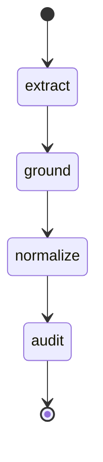

# Clinical Assessment Pipeline — Implementation Plan

**Assignment:** Stance Health · `github.com/Stance-Health/ai-assignments`
**Scope:** WAV → Whisper → LangGraph → `FirstAssessment` JSON → MongoDB → FastAPI, plus a differentiating React frontend
**Author's note:** This document is the build spec and design-rationale record. Sections 15–16 feed directly into the D6 README deliverable; the rest is the engineering plan behind D1–D5.

---

## 0. What the brief is actually asking for

Stripped of framing, the brief specifies a **contract-first** system: the deliverable isn't "an AI pipeline," it's a pipeline that produces one exact, unchanging shape of JSON, because a real frontend at Stance Health already consumes it. That reframes every decision below — the interesting engineering problem here is not "can an LLM extract clinical entities from a transcript" (yes), it's **how do you make an LLM's output trustworthy enough to sit behind a strict contract, in a domain where a wrong number is a clinical safety issue, without ever touching the contract itself to express that untrustworthiness.**

That tension — strict schema on one side, uncertain extraction on the other — is the spine of this whole plan.

Stance Health itself is a Bengaluru MSK/sports-physio and performance-recovery company running multiple clinics at real volume (thousands of sessions/month across several centers), built around a staged recovery model. Two things follow from that context that matter for design decisions later: (1) this form is filled out by a working clinician between patients, many times a day — it has to be fast and scannable, not a showcase; (2) "never hallucinate clinical values, scores, or dates" isn't a throwaway line in the brief, it's the actual product risk, since these numbers likely feed a treatment plan.

---

## 1. Prior art: what the other two submissions did

Both other candidate branches were pulled and read in full before writing this plan, specifically to avoid re-deriving the same solution and to find the gaps.

| Dimension | Candidate A (`adityadattatre43…`) | Candidate B (`lakshanargtl…`) |
|---|---|---|
| Module layout | Flat `app/` (config, schemas, transcription, agent, db, main) | Layered: `models/`, `repositories/`, `services/` (transcription, extraction, confidence, pipeline), `db/` |
| Mongo driver | **Motor** (async), matches FastAPI's async model | `pymongo` (sync) inside mostly `def` (sync) route handlers |
| LLM backend | Multi-provider (Gemini/OpenAI/Anthropic/Ollama) via LangChain, **plus a rule-based regex/keyword fallback extractor** so the pipeline still runs with zero API keys | Single local model via **Ollama only** — no cloud dependency at all |
| Audio decode | `soundfile` + `scipy.signal.resample_poly`, no system `ffmpeg` binary required | Standard Whisper + system `ffmpeg` dependency |
| LangGraph shape | 3 nodes: `extract → normalize → audit`, with a try/except fallback to plain sequential calls if `StateGraph` fails to compile | 2 nodes: `extract → validate` |
| Anti-hallucination approach | Deterministic **numeric grounding**: spoken ROM degrees / pain-scale numbers are string-matched back against the transcript; ungrounded numbers get a confidence penalty | LLM self-reports a confidence float per field; checked against an env-configured `CONFIDENCE_THRESHOLD` |
| Where confidence lives | **Never in the response body.** Delivered via `X-Extraction-Confidence` / `X-Extraction-Flags` response headers, and as an internal `meta` block in Mongo. Body is a byte-for-byte `FirstAssessment`. | Custom `ExtractionConfidenceError` → structured `422` body with a `ConfidenceErrorDetail` list (field / confidence / threshold / reason) |
| Schema strictness | Pydantic v2, `extra="forbid"` on every nested model, `None → ""` coercion via a shared base class | Pydantic v2, `extra="forbid"`, same 7-section shape, no null-coercion validator |
| Reproducibility | No Dockerfile. `.env.example` + venv instructions. Sample `output_assessment.json` / `transcript.txt` committed, and a `test_e2e_live.py` — evidence it was actually run against real audio. | No Dockerfile. Requires locally running Ollama *and* a local MongoDB *and* system ffmpeg — heaviest local setup of the two, no committed sample output. |
| Testing | Schema tests + API tests + one live end-to-end test | Schema tests + pipeline test + API test (mocked, no live run committed) |
| Frontend | None | None |

Both independently converged on the **same 7-section `FirstAssessment` shape** (confirms it's the one correct reading of the brief, not ambiguous), and both correctly identified that confidence/flags cannot live inside the response body if "no extra fields" is to be honored. That convergence is useful: it tells us the *contract* work is table stakes, not where anyone will stand out.

**What neither did**, and where the actual opportunity is:

1. Neither built anything for the frontend that the brief explicitly says exists ("our production frontend consumes" this JSON). Nobody showed they understood *why* the schema is strict — only that it must be.
2. Neither combined the two anti-hallucination ideas. Candidate A's deterministic numeric grounding is stronger evidence than Candidate B's LLM self-report, but A never uses grounding to *cap* an overconfident LLM score — it only adds a separate flag.
3. Neither shipped a one-command environment. Reviewer setup for B requires installing and running Ollama, pulling a 3B model, and running local Mongo, before they can execute anything.
4. Neither persists *evidence* for a flag — just a reason string. There's no way to show a clinician (or a reviewer) exactly which words in the transcript a value came from.
5. Neither addresses audio beyond the single provided clip — no stated chunking policy for a real 20–40 minute clinic session, which is what a "production" version of this actually has to handle.

---

## 2. Differentiation thesis

Everything in this plan optimizes for one sentence: **the confidence signal is a first-class, evidence-backed object that never touches the `FirstAssessment` body, and the frontend is the thing that proves that decision was worth making.**

Concretely, four choices carry the whole submission:

1. **Hybrid, capped confidence** — LLM self-report and deterministic transcript grounding are combined with a hard ceiling, not just two independent signals, so the model can't talk itself into a high score for a number that isn't actually in the transcript.
2. **Evidence spans, not just reasons** — every grounded field stores the transcript substring it was grounded against, so "why is this flagged" has a literal, inspectable answer.
3. **A real (if intentionally small) consumer of the schema** — a React report view in the Swiss/editorial style the frontend brief for this pipeline implies, built off the FastAPI OpenAPI schema so the two layers cannot silently drift.
4. **Reviewer-experience as a deliverable** — `docker compose up` produces a running system (Mongo included), because the person grading six of these in a row will notice which ones cost them twenty minutes of local setup.

---

## 3. System architecture

```mermaid
flowchart LR
    A[WAV upload<br/>multipart/form-data] --> B[Audio Guard<br/>sniff header, resample to 16kHz mono]
    B --> C[Whisper<br/>transcription]
    C --> D{LangGraph Agent}
    D -->|extract| D1[Extract Node<br/>structured LLM call]
    D1 -->|ground| D2[Ground Node<br/>deterministic transcript check]
    D2 -->|normalize| D3[Normalize Node<br/>coerce to FirstAssessment shape]
    D3 -->|audit| D4[Audit Node<br/>compose ConfidenceReport]
    D4 --> E{overall confidence<br/>>= threshold?}
    E -->|no| F[422 Unprocessable Entity<br/>field-level detail]
    E -->|yes| G[FirstAssessment JSON<br/>exact schema, response body]
    G --> H[(MongoDB)]
    H --> I[FastAPI read endpoints]
    I --> J[React / shadcn report UI]
    G -. confidence headers .-> J
```



The Whisper stage sits **outside** the LangGraph graph on purpose: transcription is a deterministic, single-shot transformation with no branching or retries worth modeling as graph state — putting it in the graph just adds indirection. The graph starts once there's text to reason over.

---

## 4. Repository layout

```text
.
├── app/
│   ├── main.py                  # FastAPI app, routers, exception handlers
│   ├── config.py                # pydantic-settings; one source of truth for env vars
│   ├── models/
│   │   └── assessment.py        # FirstAssessment + nested Pydantic v2 models (the contract)
│   ├── models/internal.py       # FieldConfidence, ConfidenceReport, AssessmentRecord (never returned raw)
│   ├── services/
│   │   ├── audio.py             # WAV validation + resample (ffmpeg-free)
│   │   ├── transcription.py     # Whisper wrapper, chunking policy
│   │   ├── extraction.py        # LangGraph build_graph(), node functions
│   │   ├── grounding.py         # deterministic numeric/date evidence matching
│   │   └── confidence.py        # score fusion + threshold policy
│   ├── repositories/
│   │   └── assessment_repository.py   # all Mongo I/O behind one interface
│   └── db/
│       └── mongo.py             # Motor client lifecycle (startup/shutdown)
├── scripts/
│   └── run_pipeline.py          # CLI: WAV in, JSON to stdout + file, exit code encodes confidence
├── tests/
│   ├── test_schema.py           # contract invariants (no nulls, arrays always arrays, extra=forbid)
│   ├── test_grounding.py        # numeric/date evidence matcher, property-based
│   ├── test_pipeline.py         # graph run against a fixed transcript fixture (no network)
│   ├── test_api.py              # endpoint contracts, status codes, pagination
│   └── fixtures/
│       └── clinical_assessment.wav   # the provided sample, used as a golden-path regression test
├── frontend/                    # see §11 — separate Vite app, own package.json
├── docker-compose.yml
├── Dockerfile
├── .env.example
├── requirements.txt
└── README.md
```

This borrows Candidate B's layered separation (services/repositories/models) because it tests better in isolation than Candidate A's flatter file-per-concern layout, and borrows Candidate A's use of Motor for true async Mongo I/O under an async framework, plus its ffmpeg-free audio path — the strongest single idea in either submission, worth keeping outright rather than reinventing.

---

## 5. Tech stack

| Layer | Choice | Why |
|---|---|---|
| API | FastAPI, fully async route handlers | Matches the async DB driver; avoids threadpool overhead on I/O-bound endpoints |
| ASR | `openai-whisper`, `base` or `small` model, local | No per-request API cost or network dependency for the graded sample; swappable for `faster-whisper` later without touching callers |
| Audio decode | `soundfile` + `scipy.signal.resample_poly` | No system `ffmpeg` binary in the grading environment's PATH to depend on |
| Agent | LangGraph (`StateGraph`) over LangChain structured output | Explicit, inspectable node boundaries beat a single freeform prompt when a step ("did we ground this number") needs to be independently testable |
| LLM backend | Provider-agnostic via LangChain (Anthropic/OpenAI/Gemini), env-selected, **no bespoke rule-based fallback** | A regex fallback (Candidate A's idea) quietly degrades extraction quality without saying so in the confidence score — better to fail loud (503) than silently downgrade accuracy |
| Schema | Pydantic v2, `extra="forbid"`, custom base validator | Contract enforcement at the type level, not by convention |
| DB | MongoDB via Motor (async) | Native JSON-shaped storage for a JSON-shaped document; async matches FastAPI |
| Frontend | React + Vite + TypeScript, shadcn/ui, Tailwind | See §11 |
| Packaging | Docker Compose (`app` + `mongo`) | One command, no local Python/Mongo/ffmpeg install required to review |

---

## 6. The `FirstAssessment` contract

This is dictated entirely by the brief (Step 3 of 5) — both prior submissions and this one arrive at the same shape, which is the confirmation it's read correctly, not a design choice in itself:

```python
from __future__ import annotations
from typing import Any, List
from pydantic import BaseModel, ConfigDict, Field, field_validator


class _Strict(BaseModel):
    """Shared contract rules: no unknown keys, no null strings."""
    model_config = ConfigDict(extra="forbid", str_strip_whitespace=True)

    @field_validator("*", mode="before")
    @classmethod
    def _null_string_to_empty(cls, v: Any, info):
        field = cls.model_fields.get(info.field_name)
        if field is not None and field.annotation is str and v is None:
            return ""
        return v


class ClinicalDetails(_Strict):
    clinicalHistory: str = ""
    chiefComplaint: str = ""
    duration: str = ""


class SubjectiveAssessment(_Strict):
    testName: str = ""
    conclusion: str = ""


class ObjectiveTest(_Strict):
    testName: str = ""
    unitName: str = ""
    value: str = ""
    left: str = ""
    right: str = ""
    comments: str = ""


class ObjectiveAssessment(_Strict):
    tests: List[ObjectiveTest] = Field(default_factory=list)


class SubjectiveGoal(_Strict):
    goalDetails: str = ""
    targetDate: str = ""


class ObjectiveGoal(_Strict):
    goalName: str = ""
    goalCategory: str = ""
    unitName: str = ""
    value: str = ""
    targetDate: str = ""


class Recommendation(_Strict):
    sessionType: str = ""
    sessionFrequency: str = ""


class PatientAdvice(_Strict):
    adviceDetails: str = ""


class FirstAssessment(_Strict):
    clinicalDetails: ClinicalDetails = Field(default_factory=ClinicalDetails)
    subjectiveAssessments: List[SubjectiveAssessment] = Field(default_factory=list)
    objectiveAssessment: ObjectiveAssessment = Field(default_factory=ObjectiveAssessment)
    subjectiveGoals: List[SubjectiveGoal] = Field(default_factory=list)
    objectiveGoals: List[ObjectiveGoal] = Field(default_factory=list)
    recommendation: List[Recommendation] = Field(default_factory=list)
    patientAdvice: PatientAdvice = Field(default_factory=PatientAdvice)
```

**Where confidence actually lives** — kept entirely out of the class above, in `models/internal.py`:

```python
class FieldEvidence(BaseModel):
    field: str                  # dot-path: "objectiveAssessment.tests[0].value"
    confidence: float           # 0.0–1.0, post-fusion (see §7)
    llm_confidence: float       # raw self-reported score, pre-fusion
    grounded: bool              # did deterministic matching find support?
    evidence_span: str | None   # the transcript substring it was matched against, if any
    reason: str                 # short human-readable explanation


class ConfidenceReport(BaseModel):
    overall: float
    threshold: float
    flags: list[FieldEvidence]  # only fields below threshold or ungrounded numerics
    passed: bool


class AssessmentRecord(BaseModel):
    """What GET /assessments/{id} actually returns — a wrapper, not the raw contract."""
    id: str
    createdAt: datetime
    assessment: FirstAssessment
    confidence: ConfidenceReport | None = None
```

The distinction that matters: `POST /assessments/parse`'s **response body** is a bare `FirstAssessment` — the brief is explicit that this exact endpoint's output must have no extra keys. `GET /assessments/{id}` is a *record retrieval* endpoint, not the mapping-step output the brief is constraining, so it's free to return the richer `AssessmentRecord` wrapper. That's a small reading of the spec, but it's the one both other candidates independently reached too — and it's what makes the frontend's evidence UI (§11) possible at all without ever touching the strict contract.

---

## 7. Confidence: fusion, not just reporting

The core anti-hallucination idea in this plan is combining what each other submission did alone, then adding a ceiling:

1. **LLM self-report** (like Candidate B): the extraction prompt requires a `confidence: float` per populated field, with a one-line justification, as part of its structured output.
2. **Deterministic grounding** (like Candidate A, generalized): for every field that is a **number, a measurement, or a date**, a separate, non-LLM check searches the transcript for a matching literal or normalized token within a bounded word-window of the associated test/goal name.
   - Numeric: `"52 degrees"` extracted → transcript must contain `"52"` (or a close spoken-number match, e.g. "fifty two") near `"flexion"` or the relevant test name.
   - Date: `"targetDate": "2026-10-22"` → transcript must contain a phrase that resolves to that date (`"six weeks"`, `"in a month"`) — resolved via a small relative-date parser seeded with the session date, not just a raw substring match.
3. **Fusion rule** — this is the actual improvement over either submission alone:

   ```python
   def fuse(llm_confidence: float, grounded: bool, is_numeric_or_date: bool) -> float:
       if is_numeric_or_date and not grounded:
           # An LLM can be very confident about a number it invented.
           # Grounding failure caps the score regardless of self-report.
           return min(llm_confidence, 0.35)
       return llm_confidence
   ```

   A field the model claims 0.9 confidence on, but that has no support in the transcript, cannot pass at 0.9 — it is hard-capped. This directly targets the brief's "never hallucinate clinical values, scores, or dates" line with a mechanism, not a prompt instruction alone (prompt instructions are necessary but not sufficient — LLMs still occasionally ignore them, especially under a compressed or noisy transcript).

4. **Evidence capture** — the matched transcript span (or `None` if ungrounded) is stored alongside the score, not just a boolean. This is what §11's UI hovers over.

Non-numeric free-text fields (`chiefComplaint`, `adviceDetails`, `goalDetails`) are **not** grounded this way — there's no reliable literal-match signal for prose, so they rely on LLM self-report plus a floor check (empty/placeholder text like "not mentioned" is treated as a legitimate low-confidence-but-not-invented value, not an error).

`overall` confidence is the minimum of all populated fields' fused scores, not an average — one bad number shouldn't be diluted by six confident ones. If `overall < threshold`, the endpoint returns `422` with the full `ConfidenceReport.flags` list as the body detail.

---

## 8. Whisper transcription module

```python
# services/transcription.py (shape, not full implementation)
def transcribe(audio_path: Path, *, model_size: str = "base") -> TranscriptResult:
    ...
```

Design notes:

- **Resampling, not ffmpeg.** The provided sample (`clinical_assessment.wav`) is mono, 44.1 kHz, 16-bit PCM, ~105 seconds — a realistic single-clip test case, but the resample step is what generalizes: any WAV gets decoded via `soundfile` and resampled to Whisper's required 16 kHz mono via `scipy.signal.resample_poly`, so there's no dependency on a system `ffmpeg` binary being present in whatever environment this gets graded or deployed in.
- **Chunking policy for real sessions.** The demo clip is under two minutes, but a real Stance Health assessment session runs far longer. The module accepts audio of any length and internally chunks on Whisper's own VAD-assisted segment boundaries rather than a naive fixed-size window, so a 30-minute session doesn't need separate code from the 105-second demo file — it's the same function, just more segments.
- **Failure mode:** corrupt/non-WAV upload is rejected at the `audio.py` guard stage (magic-byte + `soundfile.info()` check) before it ever reaches Whisper — a `400`, not a `500` fifteen seconds into a wasted transcription.
- **Output includes timestamps per segment** (`[(start, end, text), ...]`), not just a flat string — this is what makes date/number grounding in §7 more precise (grounding can optionally search only nearby-in-time segments rather than the whole transcript for a given field, once the extraction node also returns which segment a value likely came from).

---

## 9. LangGraph agent design



Four nodes, one more than either prior submission, because grounding is pulled out as its own node rather than folded into extraction or audit — it has a distinct responsibility (deterministic, no LLM call) and is the piece most worth unit-testing in isolation:

- **`extract`** — one structured-output LLM call (temperature 0, JSON-mode / tool-calling, not free text parsing) against the transcript, producing a draft `FirstAssessment` plus a per-field `llm_confidence` and one-line reason. The prompt explicitly instructs: leave a field as `""` / empty list rather than inferring a plausible-sounding value, and never round or estimate a number that wasn't stated.
- **`ground`** — pure Python, no LLM: runs the §7 deterministic check against every numeric/date field in the draft, attaches `grounded` + `evidence_span`.
- **`normalize`** — coerces the draft through the actual `FirstAssessment` Pydantic model (catches type drift, enforces `extra="forbid"`, guarantees arrays-not-null) — this is where a malformed LLM response fails fast rather than silently propagating.
- **`audit`** — applies the fusion rule, assembles the `ConfidenceReport`, decides pass/fail against the threshold.

State schema:

```python
class AgentState(TypedDict, total=False):
    transcript: str
    segments: list[tuple[float, float, str]]
    session_date: str | None
    draft: FirstAssessment
    field_scores: list[FieldEvidence]
    confidence_report: ConfidenceReport
```

Graph construction wraps `.compile()` in a fallback that runs the four functions sequentially if `StateGraph` compilation fails for any reason (dependency mismatch, etc.) — cheap insurance Candidate A included and worth keeping, since the graph structure here is a simple chain, not a real DAG with branches, and losing it shouldn't lose the whole pipeline.

---

## 10. FastAPI endpoints

| Endpoint | Method | Success | Failure modes |
|---|---|---|---|
| `/assessments/parse` | `POST` (multipart `file`) | `200`, body = bare `FirstAssessment` | `400` bad/non-WAV file · `422` confidence below threshold (body = `ConfidenceReport`) · `500` transcription/LLM failure |
| `/assessments` | `POST` (JSON body) | `201`, body = `AssessmentRecord` | `400` schema validation failure |
| `/assessments/{id}` | `GET` | `200`, body = `AssessmentRecord` | `404` unknown id, `400` malformed ObjectId |
| `/assessments` | `GET` (`?from=&to=&limit=&skip=`) | `200`, body = `{items: [...], total: int}` | `400` `from > to` |

Response headers on `/parse`, regardless of status: `X-Extraction-Confidence`, `X-Extraction-Model`, `X-Pipeline-Latency-Ms` (broken down per stage: `whisper`, `extract`, `ground`, `audit` — cheap to log, useful for a reviewer or an on-call engineer diagnosing "why did this request take 40 seconds").

`GET /assessments` pagination returns a `total` count alongside `items` — neither prior submission does this, and a plain array response is genuinely hard for a frontend list view to paginate correctly against.

---

## 11. Frontend: Swiss International / Editorial report view

### Why this, concretely

Neither other submission touches the frontend at all, despite the brief's own framing ("the exact JSON schema our production frontend consumes"). Building a small, real consumer of that JSON is the single highest-leverage differentiator here — it's evidence of understanding *why* the schema constraints in the brief exist, not just following them.

The aesthetic direction (Swiss International / Editorial) isn't arbitrary set-dressing here — it has an actual disciplinary link to the subject matter: Swiss design's home turf historically includes pharmaceutical and clinical information design (Geigy/Sandoz, medical journal typesetting) — grid-based, legible at a glance, hierarchy carried by structure rather than color or decoration. A clinician filling this out between patients, at one of several hundred sessions a month, needs exactly that: a scannable, unambiguous document, not a "product" that announces itself.

### Design tokens

**Color** — cool, clinical, not the warm-neutral "generated site" default:

| Token | Hex | Role |
|---|---|---|
| `paper` | `#F7F7F4` | Page background |
| `ink` | `#15181B` | Primary text, rules, structure |
| `line` | `#D9DAD3` | Hairline dividers, grid guides |
| `muted` | `#6B7079` | Secondary text, metadata |
| `flag` | `#C22E1A` | **Functional only** — confidence flags, nothing decorative |
| `verified` | `#2B6E63` | Grounded/high-confidence data, objective measurements |

`flag` and `verified` are the only saturated colors on the page, and both are earned by the confidence model in §7 rather than applied for visual interest — red literally means "check this," in the Swiss transit-signage sense, not a brand accent.

**Type** — two families, clearly distinct roles, chosen away from the generic Inter/Space-Grotesk default:

- **Archivo** (grotesk, has a genuine expanded/black display cut) for headings and section numerals — carries the page's structure.
- **IBM Plex Sans** for body text and UI chrome — institutional character, avoids reading as a generic SaaS template.
- **IBM Plex Mono**, used narrowly for tabular clinical figures only (ROM degrees, left/right values in the objective-tests table) — a genuine tabular-alignment use case, not a decorative label treatment.

**Layout** — strict left-aligned grid, ragged right, never centered or justified (Müller-Brockmann's own rule): a 12-column base grid, with the report view running an asymmetric 8/4 split — an 8-column reading column for the clinical narrative sections, a 4-column margin reserved for the confidence/evidence rail.

```text
┌─ 01 CLINICAL DETAILS ──────────────────────────┬──────────────┐
│  Chief complaint                                │  ⚑ duration   │
│  Lorem ipsum clinical history text runs here    │  62% conf.    │
│  at body width, ragged right, no justification. │  "six weeks"  │
├─ 02 SUBJECTIVE ASSESSMENTS ─────────────────────┼──────────────┤
│  Test name          Conclusion                  │               │
├─ 03 OBJECTIVE ASSESSMENT ───────────────────────┼──────────────┤
│  Test    Unit   L      R      Comments          │  ⚑ ROM value  │
│  ▸ tabular figures in Plex Mono, right-aligned  │  ungrounded   │
├─ 04 GOALS (subjective + objective) ─────────────┼──────────────┤
├─ 05 RECOMMENDATION ──────────────────────────────┼──────────────┤
├─ 06 PATIENT ADVICE ──────────────────────────────┴──────────────┤
└───────────────────────────────────────────────────────────────┘
```

The section numbering (01–06) is deliberate, not decorative filler — these sections *are* a fixed sequence in real clinical documentation (history → subjective → objective → goals → plan → advice), so numbering encodes real structure rather than being applied for its own sake.

**Principle:** one typographic hero moment per screen, everything else quiet. On the upload screen, that moment is a thin waveform rule rendered from the actual decoded WAV samples with tick marks at 10-second intervals — a real representation of the uploaded file, not a stock icon. On the report screen, the margin rail *is* the hero, precisely because it's the one part of the page carrying the pipeline's most interesting output (evidence, not just data).

### Component plan (shadcn/ui)

| Component | Use |
|---|---|
| `Table` | Objective-tests grid, assessment list index |
| `HoverCard` | Hover a flagged field → shows `evidence_span`, `llm_confidence` vs. fused `confidence`, and the reason string — the literal answer to "why is this flagged" |
| `Badge` | Confidence tier (verified / review / unconfirmed) on the margin rail |
| `Progress` + `Skeleton` | Live per-stage pipeline status while `/parse` runs (transcribing → extracting → grounding → validating), driven by the `X-Pipeline-Latency-Ms` breakdown once complete, polled/streamed while in flight |
| `Command` | Quick filter over the assessment list (by date, by flag count) |
| `Calendar` | Date-range filter, backing `GET /assessments?from=&to=` |
| `Sonner` (toast) | Save confirmation on `POST /assessments` |

### Pages

1. **New Assessment** — drag-drop WAV, waveform preview, staged progress indicator, then routes to the report view once `/parse` returns.
2. **Report** — the Swiss/editorial layout above; a persistent "Save" action against `POST /assessments`; a print stylesheet (`@media print`) that collapses the evidence rail, since a clinician may genuinely need a clean printed/PDF chart note — a real requirement for a clinic tool, not a nice-to-have.
3. **Index** — tabular list of saved assessments (date, chief complaint excerpt, flag count as a `Badge`), filterable by date range.

### Keeping the two layers honest

The frontend's TypeScript types are generated from FastAPI's own `openapi.json` (`openapi-typescript` at build time) rather than hand-mirrored — the backend contract and the frontend types can't drift silently, which is exactly the failure mode a strict-schema brief like this one is trying to prevent in the first place. This is arguably the single most "practical, not just aesthetic" decision in the whole frontend plan: it's a build step, not a design choice, and it directly enforces the brief's own "no extra fields, no renamed keys" requirement across the API boundary instead of only inside the Python process.

---

## 12. MongoDB design

- Single `assessments` collection. Document shape mirrors `AssessmentRecord`: `{_id, createdAt, assessment: {...FirstAssessment}, confidence: {...ConfidenceReport} | null}`.
- Index: `{createdAt: -1}` for the default list-sorted-by-recency query, supporting `GET /assessments?from=&to=` range scans directly.
- `assessment` is stored as the exact nested document, not a flattened/normalized form — there's no query pattern here that benefits from relational decomposition, and keeping it nested means "what got returned" and "what got stored" are structurally identical, which simplifies both the repository code and any future migration when the schema version bumps.
- `repositories/assessment_repository.py` is the only file that imports Motor directly — services and routes depend on its interface, not the driver, so swapping persistence later (or mocking it in tests via `mongomock-motor`) doesn't ripple outward.

---

## 13. Testing strategy

| Layer | Tool | What it catches |
|---|---|---|
| Contract invariants | `pytest` + Pydantic | Nulls where strings are required, non-list where a list is required, unexpected extra keys — run against both valid and deliberately malformed payloads |
| Grounding logic | `pytest` + Hypothesis (property-based) | Numeric/date matcher never returns `grounded=True` for a value with no textual support, across generated transcript/number pairs |
| Pipeline | `pytest`, transcript fixture (no network/model call) | Graph wiring — `extract → ground → normalize → audit` runs in order and state accumulates correctly, independent of actual model quality |
| Golden-path regression | `pytest`, real Whisper + real LLM call against the **provided** `clinical_assessment.wav` | The one test that proves the whole system actually works end-to-end on the graded input, not just on mocks — marked `@pytest.mark.slow` / `@pytest.mark.live` so CI can skip it without a model/API key while local dev still runs it |
| API | `pytest` + `httpx.AsyncClient` | Status codes, pagination shape, 422 detail shape, 404 on bad id |
| Frontend | Vitest + React Testing Library | HoverCard renders evidence correctly for a flagged field; report view renders all 7 sections from a fixture `AssessmentRecord` |

Committing a real `output_assessment.json` + `transcript.txt` from an actual run against the provided WAV (as Candidate A did) is worth doing regardless of the automated tests — it's the fastest way for a reviewer to sanity-check the output without running anything themselves.

---

## 14. Reproducibility

Neither other submission ships a Dockerfile — Candidate B in particular requires a reviewer to install and run Ollama, pull a model, and stand up local MongoDB before anything works.

```yaml
# docker-compose.yml (shape)
services:
  app:
    build: .
    ports: ["8000:8000"]
    env_file: .env
    depends_on: [mongo]
  mongo:
    image: mongo:7
    volumes: ["mongo_data:/data/db"]
volumes:
  mongo_data:
```

`docker compose up` → API live on `:8000` with Mongo already wired, Whisper model weights cached in the image build layer. The one thing that can't be fully containerized away is an LLM API key (or a local Ollama endpoint) — documented plainly in `.env.example` as the one manual step, rather than pretending it doesn't exist.

---

## 15. README plan (D6)

1. What this is (2–3 lines, no marketing tone)
2. Architecture diagram (§3, reused directly)
3. Setup — `docker compose up`, one manual step (LLM key)
4. Running the CLI script vs. the API
5. API reference table (§10)
6. **Design decisions** — condensed from §2, §7, §11: why confidence is header/wrapper-only and never in the contract body, why grounding is capped rather than advisory, why the frontend exists at all
7. Test instructions, including how to run/skip the live golden-path test
8. Known limitations (see §16)

---

## 16. Build order

1. Schema (§6) + contract tests — nothing else can be verified without this first.
2. Audio guard + Whisper module (§8) against the provided WAV.
3. Extraction node only (no grounding yet) — get a draft `FirstAssessment` out end-to-end.
4. Grounding + fusion (§7) — the anti-hallucination core.
5. Normalize + audit nodes, full graph wiring (§9).
6. FastAPI endpoints (§10) + Mongo repository (§12).
7. Docker Compose (§14) — do this *before* the frontend, so the frontend can be built against a real running API instead of guesses.
8. Frontend (§11) — New Assessment → Report → Index, in that order.
9. README (§15).

## 17. Open questions / limitations to state plainly

- Grounding for prose fields (`chiefComplaint`, `adviceDetails`, goal narratives) has no deterministic signal equivalent to numeric matching — this is disclosed as a known gap, not silently glossed over.
- Whisper's medical/anatomical vocabulary accuracy without a fine-tuned or prompted vocabulary boost is a real risk on terms like specific special-test names — worth a short initial-prompt vocabulary hint, but not a substitute for a domain-tuned ASR model in an eventual production system.
- Multi-speaker overlap (clinician talking over patient) isn't diarized — the transcript is treated as a single stream, which is a reasonable scope cut for this assignment but worth naming as a limitation rather than pretending diarization was considered and solved.
