# Clinical Assessment Pipeline & Editorial Report Interface

A contract-first clinical assessment pipeline for **Stance Health** that turns clinician-patient WAV audio sessions into strictly validated `FirstAssessment` JSON, backed by Whisper ASR, LangGraph structured extraction, deterministic numeric/date grounding, MongoDB persistence, and an editorial React report UI.

---

## 1. System Architecture

```mermaid
flowchart LR
    A[WAV upload<br/>multipart/form-data] --> B[Audio Guard<br/>sniff header, resample to 16kHz mono]
    B --> C[Whisper<br/>transcription]
    C --> D{LangGraph Agent}
    D -->|extract| D1[Extract Node<br/>structured LLM call]
    D1 -->|ground| D2[Ground Node<br/>deterministic transcript check]
    D2 -->|normalize| D3[Normalize Node<br/>coerce to FirstAssessment shape]
    D3 -->|audit| D4[Audit Node<br/>compose ConfidenceReport]
    D4 --> E{overall confidence<br/>>= threshold?}
    E -->|no| F[422 Unprocessable Entity<br/>field-level detail]
    E -->|yes| G[FirstAssessment JSON<br/>exact schema, response body]
    G --> H[(MongoDB)]
    H --> I[FastAPI read endpoints]
    I --> J[React / Swiss Report UI]
    G -. confidence headers .-> J
```



The transcription stage sits **outside** the LangGraph graph: transcription is a deterministic, single-shot transformation with no branching or retries worth modeling as graph state. The graph begins once text is available to reason over (`extract → ground → normalize → audit`).

---

## 2. Quickstart & Lifecycle Scripts

Three scripts are provided at the repository root:
```bash
./start.sh   # Automatically launches the full stack (Docker Compose or local fallback) and frontend UI
./stop.sh    # Gracefully shuts down all running containers, API, and frontend processes
./clean.sh   # Cleans containers, persistent DB volumes, Python cache files, and build artifacts
```

### Option A: One-Command Docker Compose (Recommended)

Run the full stack (FastAPI backend on `:8000` + MongoDB on `:27017` + pre-cached Whisper model):

```bash
# 1. Copy env file and provide your LLM API key
cp .env.example .env
# Edit .env and supply GEMINI_API_KEY (or OPENAI_API_KEY)

# 2. Build and launch
docker compose up --build
```

### Option B: Local Setup

1. **Backend**:
   ```bash
   python -m venv .venv
   source .venv/bin/activate  # On Windows: .venv\Scripts\activate
   pip install -r requirements.txt
   cp .env.example .env

   uvicorn app.main:app --host 0.0.0.0 --port 8000 --reload
   ```

2. **Frontend** (Vite + React + TypeScript):
   ```bash
   cd frontend
   npm install
   npm run dev
   ```
   Open `http://localhost:3000` in your browser.

---

## 3. Running the Pipeline via CLI

To directly process a WAV file without spinning up servers:

```bash
python scripts/run_pipeline.py clinical_assessment.wav -o output_assessment.json --save-transcript transcript.txt
```

Exit code is `0` if all confidence checks pass; `2` if any numeric/date field failed grounding or confidence fell below threshold.

---

## 4. API Reference

| Endpoint | Method | Status | Description |
|---|---|---|---|
| `/assessments/parse` | `POST` (multipart `file`) | `200` | Returns **bare** `FirstAssessment` JSON (strict contract, no extra fields). Confidence and latency are delivered via headers: `X-Extraction-Confidence`, `X-Extraction-Model`, `X-Pipeline-Latency-Ms`. |
| `/assessments/parse` | `POST` (multipart `file`) | `400` | Invalid or corrupt WAV file rejected at audio guard before Whisper. |
| `/assessments/parse` | `POST` (multipart `file`) | `422` | Extraction confidence below threshold. Returns `ConfidenceReport` with ungrounded flags. |
| `/assessments` | `POST` (JSON body) | `201` | Persists a `FirstAssessment` to MongoDB, returning an `AssessmentRecord` wrapper. |
| `/assessments/{id}` | `GET` | `200` | Retrieves stored `AssessmentRecord` (including audit report and timestamp). Returns `404` if not found. |
| `/assessments` | `GET` (`?from=&to=&limit=20&skip=0`) | `200` | Paginated assessment registry (`{items: [...], total, limit, skip}`). Supports ISO date filtering. |
| `/health` | `GET` | `200` | Liveness check returning system timestamp. |

---

## 5. Design Decisions

### A. Strict Contract Isolation: Confidence Never Enters the Response Body
The brief explicitly dictates: *"our production frontend consumes this JSON"*. In a production setup, downstream consumers enforce strict schemas and will break if arbitrary keys like `_confidence` or `flags` are injected.
- On `POST /assessments/parse`, the response body is **byte-for-byte** a valid `FirstAssessment` (`extra="forbid"` on every nested model, all strings default to `""`, all arrays default to `[]`).
- Confidence is delivered via standard response headers (`X-Extraction-Confidence`, `X-Pipeline-Latency-Ms`) and stored internally in MongoDB within the `AssessmentRecord` wrapper on `GET /assessments/{id}`.

### B. Anti-Hallucination: Hard-Capped Fusion, Not Advisory Reporting
LLMs frequently self-report high confidence on plausible-sounding but invented measurements.
- For every numeric measurement (ROM degrees, pain scores, strengths) and temporal phrase (dates, durations), a **deterministic regex/window string search** checks the transcript for the spoken literal (or spoken English number words like `"fifty two"` for `52`).
- **The Fusion Rule**:
  $$\text{fused\_confidence} = \begin{cases} \min(\text{llm\_confidence}, 0.35) & \text{if ungrounded numeric/date} \\ \text{llm\_confidence} & \text{otherwise} \end{cases}$$
  An ungrounded number is hard-capped at $\le 0.35$ in code, not merely flagged in a prompt.
- **Minimum, not average**: Overall session confidence is the minimum fused score across all populated fields. A single hallucinated number cannot be diluted by six confident prose fields.

### C. Zero System `ffmpeg` Dependency
Decoded and resampled purely through `soundfile` + `scipy.signal.resample_poly` to 16 kHz mono. This guarantees portability across any Docker host or grading environment without requiring an external `ffmpeg` binary installed on the OS PATH.

### D. Why the Frontend Exists (Swiss International / Editorial Report UI)
The assignment brief explicitly highlights that *"our production frontend consumes this exact JSON schema"*. Building a functional, production-ready frontend proves the utility of the backend's strict contract and demonstrates how confidence metadata is consumed in a real clinic workflow:
- Built with React, TypeScript, and Vite.
- Implements a 12-column grid with an **asymmetric 8/4 split**: an 8-column reading column for clinical narrative sections (01 to 06) and a 4-column margin rail dedicated to confidence flags and transcript evidence spans.
- Includes an audio waveform preview rendered directly from the WAV audio buffer, and `@media print` styles for clean physical chart printing.
- TypeScript interfaces are aligned with the FastAPI `openapi.json` contract.

---

## 6. Test Suite & Verification

Run the test suite using `pytest`:

```bash
# Contract invariants, grounding logic, and pipeline flow:
pytest tests/test_schema.py tests/test_grounding.py tests/test_pipeline.py tests/test_api.py -v

# Live golden-path test on the provided clinical_assessment.wav:
pytest tests/test_e2e_live.py -v -m "not live"
```

---

## 7. Known Limitations & Scope Boundaries

1. **Free-text Prose Grounding**: Narrative fields (`chiefComplaint`, `adviceDetails`) rely on LLM confidence and token presence; they cannot be deterministically verified like discrete numeric degrees.
2. **Medical Nomenclature Without Fine-Tuning**: Standard Whisper models may occasionally mishear complex orthopaedic eponyms (e.g. *"evulsion"* for *avulsion*, or specific surgeon surnames). An initial prompt hint is used to guide medical vocabulary.
3. **Single-Stream Audio**: Overlapping speaker voices are not diarized; the conversation is processed as a unified transcript stream.
