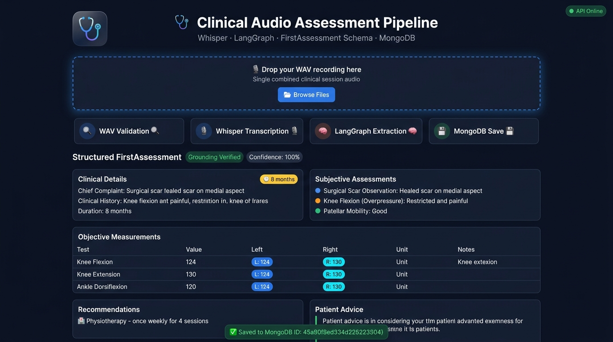

# Clinical Audio Assessment Pipeline

> Clinical Audio Intelligence Pipeline
Transforming clinician-patient conversations into structured, validated, and evidence-grounded clinical assessments.

---

## UI Preview



The web interface (served at `http://localhost:8000`) allows you to:
- **Drag-and-drop** a WAV audio file directly onto the upload zone
- Watch the **live 4-step pipeline** animate in real time (Validate → Transcribe → Extract → Save)
- View the **fully structured FirstAssessment** — clinical details, subjective findings, objective measurements table with L/R values, recommendations, and patient advice
- See the **MongoDB document ID** after successful persistence
- Toggle the **raw JSON output** with a single click

---

## System Architecture

```
                       +-----------------------+
                       |  Upload WAV File      |
                       |  (POST /assessments)  |
                       +-----------------------+
                                   |
                                   v
                         [ Audio Validator ]
                           • RIFF/WAVE header check
                           • Channel / framerate / frame count integrity
                           • File size enforcement (max 50 MB)
                                   |
                                   v
                         [ Whisper Transcriber ]
                           • Groq whisper-large-v3-turbo (default)
                           • OpenAI whisper-1 (fallback)
                           • Local Whisper model (optional)
                           • Mock transcriber (testing)
                                   |
                                   v
                     [ LangGraph Clinical Extraction Agent ]
                       Node 1: validate_transcript
                       Node 2: extract_clinical_entities  (LLM call)
                       Node 3: validate_extraction        (anti-hallucination grounding)
                       Node 4: build_first_assessment     (Pydantic validation)
                                   |
                          _________|_________
                         |                   |
                         v                   v
              [ MongoDB Persistence ]   [ HTTP JSON Response ]
              [ POST /assessments ]     [ FirstAssessment ]
```

---

## Anti-Hallucination and Evidence Grounding

Every extracted field is verified against the raw transcript before being included in the output:

1. **Prompt-Level Constraints** — The system prompt explicitly prohibits inventing symptoms, fabricating test names, or adding recommendations not stated by the clinician.
2. **Word-Level Grounding Check** — Each populated string field is cross-referenced against the transcript. Fields with insufficient verbatim evidence are automatically **pruned**.
3. **Speaker-Aware Validation**:
   - `recommendation` and `patientAdvice` → validated against the **doctor** portion of the transcript.
   - `clinicalHistory`, `chiefComplaint`, `duration` → validated against the **patient** portion.
4. **Confidence Scoring** — A confidence score (grounded fields / total checked fields) is computed. If below the `CONFIDENCE_THRESHOLD` (default 0.70), the extraction is rejected.
5. **Pydantic v2 Schema Guarantees** — All missing fields serialize as `""`, never `null`. Array fields remain arrays even if empty.

---

## FirstAssessment Schema

```json
{
  "clinicalDetails": {
    "clinicalHistory": "string",
    "chiefComplaint": "string",
    "duration": "string"
  },
  "subjectiveAssessments": [
    { "testName": "string", "conclusion": "string" }
  ],
  "objectiveAssessment": {
    "tests": [
      {
        "testName": "string",
        "unitName": "string",
        "value": "string",
        "left": "string",
        "right": "string",
        "comments": "string"
      }
    ]
  },
  "subjectiveGoals": [
    { "goalDetails": "string", "targetDate": "string" }
  ],
  "objectiveGoals": [
    {
      "goalName": "string",
      "goalCategory": "string",
      "unitName": "string",
      "value": "string",
      "targetDate": "string"
    }
  ],
  "recommendation": [
    { "sessionType": "string", "sessionFrequency": "string" }
  ],
  "patientAdvice": {
    "adviceDetails": "string"
  }
}
```

---

## Sample Output

Real output from `data/clinical_assessment.wav` (left knee post-ORIF physiotherapy session):

```json
{
  "clinicalDetails": {
    "clinicalHistory": "Left tibial condyle fracture and avulsion ACL tear from a road traffic accident; ORIF performed by Dr. Hemant Kalyan, followed by 4-6 weeks non-weight bearing and progressive loading.",
    "chiefComplaint": "Left knee pain, difficulty performing functional activities and walking, ankle and back pain during prolonged walking.",
    "duration": "8 months"
  },
  "subjectiveAssessments": [
    { "testName": "Surgical Scar Observation", "conclusion": "Healed scar on medial aspect of knee" },
    { "testName": "Knee Flexion (Overpressure)", "conclusion": "Restricted and painful" },
    { "testName": "Knee Extension", "conclusion": "Restricted" },
    { "testName": "Knee Swelling", "conclusion": "Present" },
    { "testName": "Patellar Mobility", "conclusion": "Good" },
    { "testName": "Hip Range of Motion", "conclusion": "Generally full and pain-free, left hip extension restricted" }
  ],
  "objectiveAssessment": {
    "tests": [
      { "testName": "Knee Flexion",         "unitName": "degrees", "left": "124", "right": "130" },
      { "testName": "Knee Extension",        "unitName": "degrees", "left": "20",  "right": "-5"  },
      { "testName": "Hip Internal Rotation", "unitName": "degrees", "value": "45", "comments": "bilateral" },
      { "testName": "Hip External Rotation", "unitName": "degrees", "value": "60", "comments": "bilateral" },
      { "testName": "Ankle Dorsiflexion",    "unitName": "degrees", "left": "4.5", "right": "12"  }
    ]
  },
  "subjectiveGoals": [],
  "objectiveGoals": [],
  "recommendation": [
    { "sessionType": "Physiotherapy", "sessionFrequency": "once weekly for 4 sessions" }
  ],
  "patientAdvice": {
    "adviceDetails": "Emphasis on restoring knee extension, improving knee stability and single leg stability, strengthening the quadriceps and functional lower limb musculature, improving ankle mobility, and activating the posterior chain."
  }
}
```

---

## API Endpoints

| Method | Endpoint | Description |
|--------|----------|-------------|
| `GET` | `/` | Web UI (Clinical Assessment Dashboard) |
| `GET` | `/health` | Health check — returns API status |
| `POST` | `/assessments/parse` | **EP1** — Upload a single WAV → returns `FirstAssessment` JSON |
| `POST` | `/assessments` | **EP2** — Save a `FirstAssessment` JSON to MongoDB |
| `GET` | `/assessments/{id}` | **EP3** — Retrieve an assessment by UUID |
| `GET` | `/assessments?date=YYYY-MM-DD` | **EP4** — List assessments with optional date filter |

Interactive Swagger docs: **`http://localhost:8000/docs`**

---

## Project Structure

```
.
├── app/
│   ├── agents/
│   │   ├── clinical_extraction_graph.py   # LangGraph 4-node extraction pipeline
│   │   └── prompts.py                     # Clinical extraction system prompt
│   ├── api/routes/
│   │   └── assessments.py                 # FastAPI route handlers (EP1-EP4)
│   ├── core/
│   │   ├── config.py                      # Pydantic settings (env-driven)
│   │   ├── errors.py                      # Custom exception handlers
│   │   └── logging.py                     # Structured logging setup
│   ├── models/
│   │   └── assessment.py                  # MongoDB document model
│   ├── repositories/
│   │   └── assessment_repository.py       # MongoDB CRUD operations
│   ├── schemas/
│   │   └── first_assessment.py            # Pydantic v2 FirstAssessment schema
│   ├── services/
│   │   ├── assessment_service.py          # Orchestration layer
│   │   ├── audio_validator.py             # WAV validation (RIFF/header/size)
│   │   ├── extraction.py                  # LangGraph service wrapper
│   │   └── transcription.py              # Whisper transcribers (API/Local/Mock)
│   ├── static/
│   │   └── index.html                     # Web UI dashboard
│   └── main.py                            # FastAPI app factory
├── data/
│   └── clinical_assessment.wav            # Sample clinical audio recording
├── docs/
│   └── ui_screenshot.jpg                  # UI preview screenshot
├── scripts/
│   └── test_pipeline.py                   # CLI end-to-end test runner
├── tests/
│   ├── conftest.py                        # Pytest fixtures & mock helpers
│   ├── test_api.py                        # API route integration tests
│   ├── test_end_to_end.py                 # Full pipeline E2E test
│   ├── test_extraction.py                 # LangGraph extraction unit tests
│   ├── test_grounding.py                  # Anti-hallucination grounding tests
│   ├── test_mongodb.py                    # MongoDB persistence tests
│   ├── test_schema.py                     # Pydantic schema validation tests
│   ├── test_transcription.py              # Transcription service tests
│   └── test_wav.py                        # Audio validation tests
├── .env                                   # Environment configuration (not committed)
├── .env.example                           # Environment template
└── requirements.txt                       # Python dependencies
```

---

## Setup and Installation

### Step 1 — Clone the Repository

```bash
git clone <repository_url>
cd Assement
```

### Step 2 — Create and Activate a Virtual Environment

**Windows (Command Prompt / PowerShell):**
```bash
python -m venv venv
venv\Scripts\activate
```

**macOS / Linux:**
```bash
python3 -m venv venv
source venv/bin/activate
```

> ✅ You should see `(venv)` appear at the start of your terminal prompt confirming it's active.

> 💡 To deactivate the virtual environment later, just run: `deactivate`

---

### Step 3 — Install Dependencies

With the virtual environment **active**, install all required packages:

```bash
pip install -r requirements.txt
```

This installs FastAPI, LangGraph, OpenAI/Groq clients, pymongo, Pydantic v2, Whisper, and all other dependencies.

---

### Step 4 — Configure Environment Variables

Copy the example file and fill in your credentials:

**Windows:**
```bash
copy .env.example .env
```

**macOS / Linux:**
```bash
cp .env.example .env
```

Then open `.env` in any text editor and fill in your values:

```env
# ── MongoDB ────────────────────────────────────
MONGODB_URI=mongodb://localhost:27017
MONGODB_DATABASE=clinical_assessments
MONGODB_COLLECTION=assessments

# ── LLM — Groq (recommended, free tier available) ──
GROQ_API_KEY=your_groq_api_key_here
LLM_BASE_URL=https://api.groq.com/openai/v1
LLM_MODEL=openai/gpt-oss-120b
LLM_TEMPERATURE=0.0

# ── Whisper — Groq Audio API ───────────────────
WHISPER_MODE=openai
WHISPER_MODEL=whisper-large-v3-turbo

# ── Extraction Thresholds ──────────────────────
CONFIDENCE_THRESHOLD=0.70
MAX_AUDIO_SIZE_BYTES=52428800
ALLOWED_AUDIO_EXTENSIONS=.wav
```

> 💡 **Get a free Groq API key at:** https://console.groq.com/  
> Groq provides free access to both `whisper-large-v3-turbo` (audio) and `gpt-oss-120b` (LLM).

> ⚠️ **Never commit your `.env` file.** It is already listed in `.gitignore`.

---

## Running the Application

### Start the Web Server

```bash
uvicorn app.main:app --reload --host 0.0.0.0 --port 8000
```

| URL | Description |
|-----|-------------|
| `http://localhost:8000` | **Web UI Dashboard** |
| `http://localhost:8000/docs` | Swagger API documentation |
| `http://localhost:8000/health` | API health check |

### Run the CLI Pipeline (command line test)

```bash
# Uses data/clinical_assessment.wav automatically
python scripts/test_pipeline.py

# Or specify a custom audio file
python scripts/test_pipeline.py path/to/your_audio.wav
```

---

## Verification and Testing

### Run the Full Automated Test Suite

```bash
pytest -v
```

### Expected Pipeline Output (all checks pass)

```
======================================================================
PIPELINE EXECUTION VERIFICATION SUMMARY:
======================================================================
  Audio Transcription:   PASSED
  Clinical Extraction:   PASSED
  Evidence Grounding:    PASSED
  Anti-Hallucination:    ENFORCED (0 ungrounded assertions allowed)
  Pydantic Validation:   PASSED
  MongoDB Persistence:   PASSED
  MongoDB Retrieval:     PASSED
----------------------------------------------------------------------
  End-to-End Pipeline:   PASSED (100% Verified)
======================================================================
```

---

## Whisper Configuration Modes

| `WHISPER_MODE` | Description |
|----------------|-------------|
| `openai` | Uses OpenAI or Groq Audio API (default) |
| `local` | Uses locally installed `whisper` package — set `LOCAL_WHISPER_MODEL=base` |
| `mock` | Deterministic mock transcript for automated testing |

---

## Technology Stack

| Component | Technology |
|-----------|-----------|
| Web Framework | FastAPI |
| Web UI | Vanilla HTML/CSS/JS (dark clinical dashboard) |
| Transcription | OpenAI Whisper API / Groq Audio / Local Whisper |
| Extraction Agent | LangGraph (4-node stateful graph) |
| LLM | Groq `gpt-oss-120b` / OpenAI GPT-4o |
| Schema Validation | Pydantic v2 |
| Database | MongoDB (pymongo) |
| Testing | pytest + FastAPI TestClient |
