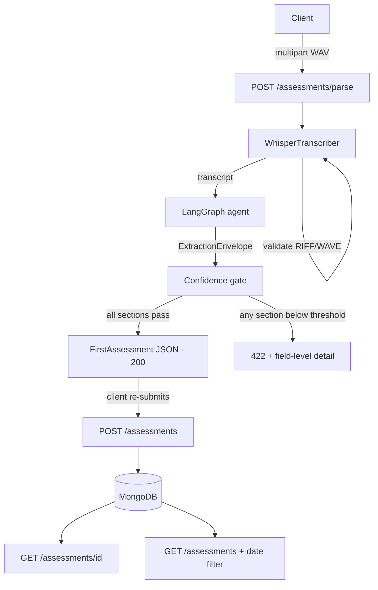
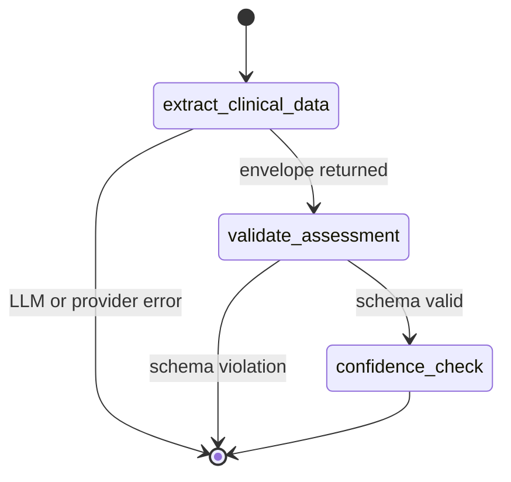

# Clinical Assessment Pipeline

Turns a clinician–patient WAV recording into a structured assessment report in
the exact JSON schema (`schema/v1`) consumed by the Stance Health clinician
frontend.

```
WAV upload
   -> Whisper transcription        (faster-whisper)
   -> LangGraph clinical extraction (structured Pydantic output)
   -> FirstAssessment validation
   -> Confidence gate              (HTTP 422 on failure)
   -> MongoDB persistence
   -> FastAPI REST API
```

---

## Tech stack

| Concern | Choice |
| --- | --- |
| API | FastAPI + Uvicorn |
| Transcription | faster-whisper (`base.en`) |
| Agent | LangGraph `StateGraph` |
| Structured output | Pydantic v2 via `with_structured_output` |
| Persistence | MongoDB (Motor async driver) |
| Config | pydantic-settings / `.env` |
| Tests | pytest (no live Mongo, Whisper, or LLM required) |

---

---

## Architecture



Parsing and persistence are deliberately separate. `POST /assessments/parse`
performs no writes, so a clinician can review an extraction before anything is
stored — appropriate when the source is a machine transcription of a clinical
session rather than a typed record.

### The LangGraph workflow



Three nodes, with conditional edges that short-circuit to `END` on failure.
Errors travel *in the graph state* rather than as exceptions, so a failure at
any node yields a structured `PipelineResult` the API layer maps onto the right
status code. The LLM is injected rather than constructed inside the graph, which
is what makes the whole agent testable without network access.

### Module responsibilities

| Module | Responsibility | Depends on |
| --- | --- | --- |
| `api/routes.py` | HTTP contract, status codes, dependency injection | agent, db, transcription |
| `agent/graph.py` | Orchestration, extraction, confidence gate | models |
| `agent/prompts.py` | Extraction instructions and confidence rubric | – |
| `transcription/whisper_service.py` | WAV validation, Whisper invocation | config |
| `models/assessment.py` | `FirstAssessment` — the frontend contract | – |
| `models/internal.py` | Envelope, confidence, stored documents | assessment |
| `db/repository.py` | Persistence, BSON handling, date windows | db/connection |
| `db/connection.py` | Motor client lifecycle | config |
| `config.py` | Environment-driven settings | – |

`models/assessment.py` has no internal dependencies by design: it is the
published contract, and nothing else in the codebase hard-codes its field
names. Swapping in a revised schema is a single-file change.

### Request lifecycle: `POST /assessments/parse`

| Step | Failure mode | Status |
| --- | --- | --- |
| 1. Filename ends `.wav` | wrong extension | 400 |
| 2. Stream to temp file, check size | exceeds `MAX_UPLOAD_BYTES` | 413 |
| 3. Validate RIFF/WAVE container | corrupt or empty audio | 400 |
| 4. Whisper transcription | empty or failed transcription | 400 |
| 5. LangGraph extraction | provider error, quota, malformed output | 502 |
| 6. Pydantic validation | schema violation | 502 |
| 7. Confidence gate | any section below threshold | 422 |
| 8. Return `FirstAssessment` | – | 200 |

The temp file is removed in a `finally` block regardless of outcome — clinical
audio should not linger on disk after a request.

### Data flow and boundaries

```
FirstAssessment          crosses the API boundary  (frontend contract)
ExtractionEnvelope       agent-internal only        (assessment + confidence)
PipelineResult           agent -> API only          (result, errors, failures)
StoredAssessment         API + database             (adds id, created_at)
```

Confidence data never crosses the API boundary on a success path. A `200`
carries exactly the seven schema sections and nothing else; a `422` carries the
confidence detail instead. This separation is what allows "exact schema match"
and "field-level confidence errors" to both be satisfied without compromise.


## Project structure

```
app/
  main.py                     FastAPI app, lifespan-managed Mongo connection
  config.py                   Settings loaded from .env
  api/routes.py               The four endpoints
  models/
    assessment.py             FirstAssessment (schema/v1) - the frontend contract
    internal.py               ExtractionEnvelope, confidence, stored documents
  transcription/
    whisper_service.py        WAV validation + faster-whisper, lazily loaded
  agent/
    graph.py                  LangGraph: extract -> validate -> confidence_check
    prompts.py                Extraction prompt
  db/
    connection.py             Motor client lifecycle
    repository.py             save / get_by_id / list + date filtering
scripts/run_pipeline.py       D5: run the pipeline on a WAV, print JSON
tests/                        Unit + API tests with fakes
```

---

## Setup

### 1. Install

```bash
python -m venv .venv
.venv\Scripts\activate          # Windows
# source .venv/bin/activate     # macOS / Linux

pip install -r requirements.txt
```

### 2. Configure

```bash
copy .env.example .env          # Windows
# cp .env.example .env
```

Set `LLM_PROVIDER` and the matching API key. Every other value has a working default.

| Variable | Default | Purpose |
| --- | --- | --- |
| `LLM_PROVIDER` | `openai` | `openai`, `google`, or `groq` |
| `OPENAI_API_KEY` / `GOOGLE_API_KEY` / `GROQ_API_KEY` | – | Key for the chosen provider (**one required**) |
| `LLM_MODEL` | provider default | Blank uses `gpt-4o-mini` / `gemini-2.0-flash` / `llama-3.3-70b-versatile` |
| `LLM_TEMPERATURE` | `0.0` | Deterministic extraction |
| `WHISPER_MODEL` | `base.en` | Whisper model size |
| `WHISPER_DEVICE` | `cpu` | `cpu` or `cuda` |
| `WHISPER_COMPUTE_TYPE` | `int8` | Quantisation |
| `MONGODB_URI` | `mongodb://localhost:27017` | Connection string |
| `DATABASE_NAME` | `stance_health` | Database |
| `ASSESSMENTS_COLLECTION` | `assessments` | Collection |
| `CONFIDENCE_THRESHOLD` | `0.70` | Quality gate |
| `MAX_UPLOAD_BYTES` | `52428800` | Upload guard (50 MB) |

`.env` is git-ignored. Only `.env.example`, with empty placeholders, is committed.

### 3. MongoDB

Any reachable instance works — local install, Docker, or Atlas:

```bash
docker run -d -p 27017:27017 --name stance-mongo mongo:7
```

The app pings Mongo at startup and creates an index on `created_at` (the field
the date filter sorts and ranges over). If Mongo is unavailable the app still
starts and `/assessments/parse` still works; only the persistence endpoints fail.

### 4. Whisper

`faster-whisper` downloads the model on first use (~150 MB for `base.en`) and
caches it. No separate ffmpeg binary is required.

### 5. Audio file

Download `clinical_assessment.wav` from the assignment page and place it at:

```
tests/fixtures/clinical_assessment.wav
```

It is git-ignored — real clinical audio does not belong in a public repository.

---

## Running

**API**

```bash
uvicorn app.main:app --reload
```

Interactive docs at <http://127.0.0.1:8000/docs>.

**Full pipeline on the provided WAV (D5)**

```bash
python scripts/run_pipeline.py tests/fixtures/clinical_assessment.wav
```

Prints per-section confidence, then the `FirstAssessment` JSON. Optional flags:
`--save-transcript`, `--save-json`, `--threshold`.

**Tests**

```bash
pytest -q
```

23 tests, no external services required.

---

## API

### `POST /assessments/parse`

Multipart WAV upload → `FirstAssessment` JSON. Does not persist.

```bash
curl -X POST http://127.0.0.1:8000/assessments/parse \
  -F "file=@tests/fixtures/clinical_assessment.wav"
```

**200**

```json
{
  "clinicalDetails": {
    "clinicalHistory": "No prior knee injury or surgery.",
    "chiefComplaint": "Sharp pain in the right knee",
    "duration": "3 weeks"
  },
  "subjectiveAssessments": [
    { "testName": "Pain scale", "conclusion": "7/10 on stairs" }
  ],
  "objectiveAssessment": {
    "tests": [
      {
        "testName": "Knee flexion ROM",
        "unitName": "degrees",
        "value": "",
        "left": "135",
        "right": "110",
        "comments": "Restricted on the right"
      }
    ]
  },
  "subjectiveGoals": [
    { "goalDetails": "Climb stairs without pain", "targetDate": "2026-10-01" }
  ],
  "objectiveGoals": [
    {
      "goalName": "Right knee flexion",
      "goalCategory": "Range of motion",
      "unitName": "degrees",
      "value": "135",
      "targetDate": "2026-10-01"
    }
  ],
  "recommendation": [
    { "sessionType": "Physiotherapy", "sessionFrequency": "Twice weekly" }
  ],
  "patientAdvice": { "adviceDetails": "Ice for 15 minutes after activity." }
}
```

**422 — confidence below threshold**

```json
{
  "detail": {
    "message": "Extraction confidence below threshold",
    "threshold": 0.7,
    "fields": [
      {
        "field": "clinicalDetails",
        "confidence": 0.42,
        "threshold": 0.7,
        "message": "Extraction confidence below threshold"
      },
      {
        "field": "objectiveGoals",
        "confidence": 0.31,
        "threshold": 0.7,
        "message": "Extraction confidence below threshold"
      }
    ]
  }
}
```

Other statuses: `400` non-WAV upload or transcription failure,
`413` oversized upload, `502` LLM provider failure.

### `POST /assessments`

Persist a parsed assessment. Returns `201`.

```json
{ "assessment": { ...FirstAssessment... }, "sourceTranscript": "optional" }
```

Response: `{ "id", "assessment", "created_at", "source_transcript" }`.

### `GET /assessments/{id}`

`200` with the stored record, `404` if absent, `400` if the id is not a valid
ObjectId.

### `GET /assessments`

Newest first. Filters:

| Query param | Meaning |
| --- | --- |
| `date=YYYY-MM-DD` | Single UTC day |
| `from_date` / `to_date` | Inclusive UTC range |
| `limit` / `skip` | Pagination (default 100 / 0) |

`date` takes precedence over the range params. A malformed date returns `422`.

> The assignment did not pin the query-parameter contract, so both the
> single-day and range forms are supported.

---

---

## Verified run on the provided recording

`clinical_assessment.wav` (8.9 MB, 1 min 45 s) was run through the full
pipeline. Whisper produced a 1,831-character transcript; the LangGraph agent
extracted a schema-conformant `FirstAssessment`.

| Section | Confidence | Gate |
| --- | --- | --- |
| `clinicalDetails` | 0.95 | pass |
| `subjectiveAssessments` | 0.85 | pass |
| `objectiveAssessment` | 0.95 | pass |
| `subjectiveGoals` | 0.10 | **below threshold** |
| `objectiveGoals` | 0.10 | **below threshold** |
| `recommendation` | 0.95 | pass |
| `patientAdvice` | 0.85 | pass |

`POST /assessments/parse` therefore returns **HTTP 422** for this recording,
naming `subjectiveGoals` and `objectiveGoals`.

**This is the correct result.** The session is a post-operative knee assessment
covering history, subjective report, objective range-of-motion measurements,
recommendation and advice — but the clinician never performs goal-setting. No
goals, target dates or functional targets appear anywhere in the transcript. The
agent reported low confidence and returned empty arrays rather than inventing
plausible goals, which is what requirement s6 (never hallucinate clinical
values, scores or dates) demands.

Every extracted value was checked against the transcript. Bilateral measurements
(knee flexion 124/130, extension 20/5, hip rotation 45/45 and 60/60, ankle
dorsiflexion 4.5/12) map correctly onto `left` and `right`; non-numeric findings
are preserved as strings; the surgeon's name and the "once weekly for four
sessions" recommendation are verbatim. Nothing was fabricated.

Two details worth noting. The transcript contains ASR corruption
("anovulsion" for avulsion, "telemobility" for patellar mobility); the agent
recovered clinical meaning from context without inventing new facts, and kept
the corrupted term where it could not. And the transcript states a provisional
diagnosis for which `schema/v1` has no field — it was dropped rather than forced
into `clinicalHistory`, honouring "no extra fields, no renamed keys".

To see the full JSON without the gate:

```bash
python scripts/run_pipeline.py tests/fixtures/clinical_assessment.wav --threshold 0.05
```

### Endpoint verification

All four endpoints were exercised against a live MongoDB instance:

| Endpoint | Case | Result |
| --- | --- | --- |
| `POST /assessments/parse` | provided WAV | 422 naming `subjectiveGoals`, `objectiveGoals` |
| `POST /assessments` | parsed assessment | 201 with generated id |
| `GET /assessments/{id}` | valid id | 200, data matches what was saved |
| `GET /assessments/{id}` | malformed id | 400 |
| `GET /assessments/{id}` | valid but absent id | 404 |
| `GET /assessments` | no filter | array containing the saved record |
| `GET /assessments` | `date` matching | record returned |
| `GET /assessments` | `date` not matching | empty array |


---

## Known limitations

**Extraction is not deterministic**
- `gemini-3.6-flash` uses fixed sampling defaults and ignores the `temperature=0.0` setting
- Repeated runs over the same transcript differ
- One observed run dropped `patientAdvice` entirely — and scored that section 0.10, so the confidence gate rejected it
- This is exactly the failure the gate exists to catch: the risk is not that the model varies, but that it varies *silently*
- In production I would corroborate self-reported confidence with token-level logprobs or a second grader model, since a model scoring its own work is a soft guarantee

**MongoDB connectivity is environment-sensitive**
- All four endpoints were verified end to end against a local MongoDB 8.3 instance, including save, retrieve by id, list, date filtering, and the 400 and 404 error paths
- An earlier attempt against MongoDB Atlas failed with `SSL: TLSV1_ALERT_INTERNAL_ERROR` on two of three replica-set nodes while the third connected normally in 47 ms — consistent with TLS interception on the development network rather than a configuration or code fault
- The driver is configured purely from `MONGODB_URI`, so switching between a local instance and Atlas is a single environment-variable change with no code edit
- TLS options belong in the connection string rather than the client constructor

**Provider coverage**
- The OpenAI, Google and Groq code paths are all implemented with lazy imports
- Only the Google path was executed end to end for the verified run


## Design decisions

**faster-whisper over openai-whisper**
- Roughly 4x faster on CPU at equivalent accuracy
- Reads WAV directly, so no ffmpeg binary on the PATH — one fewer system dependency
- Model loads lazily on first transcription, so importing the app stays cheap
- The assignment permits "Whisper (local or API)"; this is the same Whisper weights on a faster runtime

**The LLM provider is swappable**
- `LLM_PROVIDER` selects OpenAI, Google Gemini or Groq
- Each SDK is imported lazily inside the factory, so you install only what you use
- Extraction depends on the structured-output contract (`ExtractionEnvelope`), not on any vendor
- Keeps the pipeline running when a provider is rate-limited, out of quota, or no longer the right choice

**Confidence lives outside `FirstAssessment`**
- The schema must match the frontend exactly, so quality metadata cannot ride inside it
- The LLM returns an `ExtractionEnvelope`: the assessment plus a `field_confidence` map keyed by the seven camelCase section names
- The gate reads the envelope; the API returns only the clean assessment
- A `200` therefore never carries confidence data; a `422` carries all of it
- A section the model never scored is treated as `0.0`, not as a pass — silence from the model is not evidence of quality

**Schema conformance is structural, not conventional**
- "Arrays stay arrays" and "strings are never null" are enforced by Pydantic `BeforeValidator`s on the field types, not by prompt instructions
- If the LLM returns `null` for a string or a bare object where an array belongs, the model coerces it rather than emitting non-conforming JSON
- `alias_generator=to_camel` with `serialize_by_alias=True` keeps Python snake_case while every serialisation path emits camelCase
- No caller can produce snake_case by forgetting `by_alias=True`

**LangGraph shape: three nodes, conditional edges**
- `extract_clinical_data` → `validate_assessment` → `confidence_check`, short-circuiting to `END` on error
- Errors travel in the graph state rather than as exceptions, so any node failure yields a structured result the API maps onto the right status code
- The LLM is injected rather than constructed inside the graph — this is what makes the agent testable without network access

**Repository pattern for MongoDB**
- All BSON and `ObjectId` handling is confined to `db/repository.py`
- Routes deal only in Pydantic models
- Tests inject a fake collection, so the suite runs without a database
- Connection security is configured from `MONGODB_URI` alone, never hard-coded in the client constructor

**Prompt guards against hallucination**
- Extract only what the transcript supports; prefer omission over guessing on garbled ASR output
- Keep patient-reported material (subjective sections) separate from clinician-measured material (objective sections) — the distinction the schema is built around
- Use empty strings and empty arrays, never null, when information is absent
- Score a section low when the session did not cover it, so the gate can tell "not discussed" from "confidently captured"


---

## Assumptions

- `objectiveAssessment` is an object containing a `tests` array, per the
  `objectiveAssessment.tests[]` path in the assignment schema panel.
- All leaf fields are strings, including `targetDate` and numeric measurements,
  following the "all string fields must be strings" rule.
- `value` holds a single non-sided measurement; `left` / `right` hold bilateral
  ones. Unused ones are `""`.
- `created_at` is stored in UTC; date filters are evaluated in UTC.
- Confidence is self-reported by the extraction model. This is a pragmatic
  proxy — a production system would corroborate it with token-level logprobs or
  a separate grader model.
