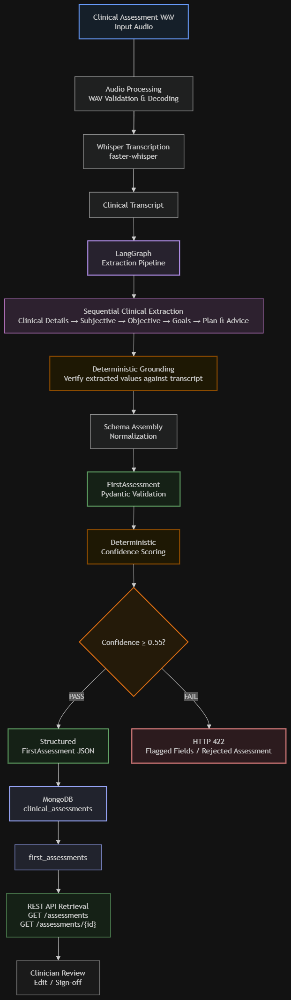
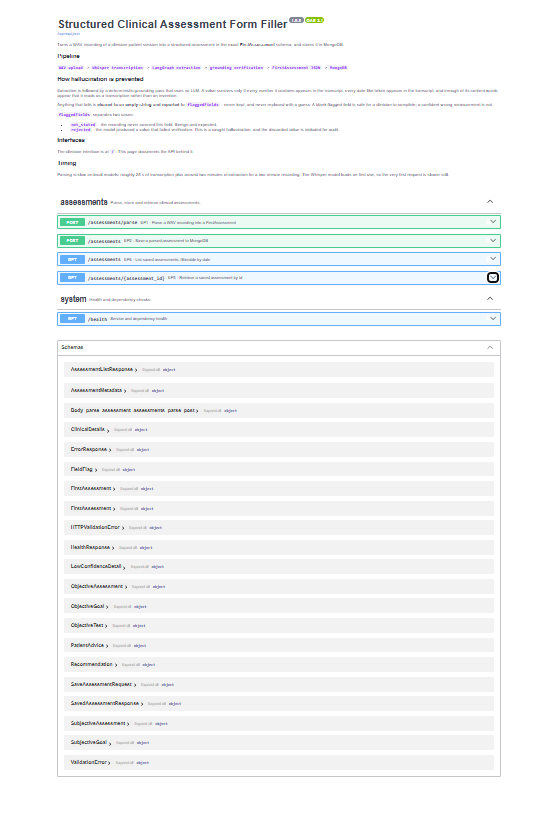

# Structured Clinical Assessment Form Filler

A FastAPI-based pipeline that converts a clinical WAV recording into a structured `FirstAssessment` JSON document using Whisper, LangGraph/LLM extraction, Pydantic validation, deterministic grounding, confidence scoring, and MongoDB persistence.

## Overview

Given a WAV recording of a clinician-patient session, the system transcribes it locally with Whisper, extracts clinical information section-by-section with a LangGraph agent, verifies every extracted value against the transcript so nothing is hallucinated, assembles the result into a strict schema, scores its confidence, and optionally persists it to MongoDB. The API returns the structured assessment along with the transcript, confidence report, and a list of fields the recording didn't cover or that failed verification.

The core engineering problem this solves is trust: a small local LLM is fast and needs no external API, but it will happily fabricate a plausible-sounding measurement or date if the recording doesn't state one. The pipeline's design assumes the model cannot be trusted to police itself, and enforces correctness with deterministic code that runs after every LLM call rather than relying on prompt wording alone.

## Architecture

<!-- ARCHITECTURE DIAGRAM -->
<p align="center">
  
</p>

**Figure 1 — End-to-end clinical assessment processing pipeline**

## Architecture & Key Design Decisions

**Local transcription.** Transcription runs entirely on-device via `faster-whisper` (CTranslate2), the default backend. This avoids a torch dependency and an ffmpeg install, and runs on CPU so it never competes with the extraction LLM for GPU memory. An alternative `openai-whisper` backend is available as an optional extra.

**LangGraph extraction as sequential stages.** A single 3B-parameter local model (`qwen2.5:3b-instruct` via Ollama) handles a flat schema reliably but a seven-section nested one poorly. The extraction agent is split into five sequential LangGraph nodes — clinical details, subjective assessment, objective measurements, goals, and plan/advice — each a focused LLM call. This also contains failure: if one section's extraction fails, the rest of the assessment still completes, with only that section flagged.

**Structured output via Pydantic.** Every LLM response is parsed as JSON and validated against a Pydantic model per section, with `extra="forbid"` at every level and normalization of `null` values (to `""` or `[]`) so the frontend never receives an unexpected shape. On a validation failure, the error is fed back to the model for a bounded number of repair attempts before that section is marked failed rather than blocking the whole request.

**Grounding.** Before any value reaches the assembled schema, it is checked against the transcript with no LLM involved: every number and date-like token in a value must appear in the transcript, and enough of the value's content words must overlap with the transcript for it to read as a transcription rather than an invention. Anything that fails is cleared to `""` and recorded — never kept, and never replaced with a guess.

**Deterministic confidence scoring.** Confidence is computed as a weighted sum of per-section completeness (weights reflect clinical importance, not field count), minus a penalty for every value grounding rejected. If overall confidence falls below `CONFIDENCE_THRESHOLD` (default `0.55`), `POST /assessments/parse` returns `422` with the partial result and field-level detail instead of a silently low-quality response.

**MongoDB persistence.** MongoDB stores the parsed assessment as a document, kept byte-identical to the API schema, with metadata (transcript, timings, confidence, model info) stored alongside it rather than merged in — so a stored assessment round-trips unchanged.

**Separation of concerns.** Audio decoding, transcription, LLM extraction, grounding/validation, persistence, and the API layer are each isolated modules (`transcription/`, `extraction/`, `schemas/`, `db/`, `api/`). Parsing does not depend on MongoDB being available; persistence is opt-in per request. This split also makes the system testable in isolation — the extraction graph, grounding logic, and confidence scoring are all pure functions that can be unit-tested with a stub LLM and no network access, independent of the API or database layers.

## Processing Pipeline

```
WAV
 ↓  Audio validation / decoding      (stdlib wave + numpy, no ffmpeg)
 ↓  Whisper transcription             (faster-whisper, CPU)
 ↓  LangGraph extraction              (5 sequential LLM nodes via Ollama)
 ↓  Grounding verification            (deterministic, no LLM)
 ↓  Schema assembly
 ↓  Pydantic validation
 ↓  Confidence scoring
 ↓  Confidence gate                   (422 if below threshold)
 ↓  MongoDB                           (optional, on request)
 ↓
Structured assessment
```

## Output Schema

The API produces a `FirstAssessment` document with exactly seven top-level sections, validated with `extra="forbid"` so no unexpected keys are ever emitted:

| Section | Purpose |
|---|---|
| `clinicalDetails` | Clinical history, chief complaint, duration |
| `subjectiveAssessments` | Subjective findings (test name + conclusion) |
| `objectiveAssessment` | Measurements — value, or left/right for sided tests |
| `subjectiveGoals` | Treatment goals with no measurable target |
| `objectiveGoals` | Treatment goals with a measurable target |
| `recommendation` | Session type and frequency |
| `patientAdvice` | Self-care instructions given to the patient |

Blank fields are represented as `""`, never `null` — the pipeline never guesses a value it can't ground.

## API

| Method | Endpoint | Purpose |
|---|---|---|
| POST | `/assessments/parse` | Upload WAV and generate an assessment |
| POST | `/assessments` | Persist an already-parsed assessment |
| GET | `/assessments/{id}` | Retrieve an assessment by id |
| GET | `/assessments` | List/filter saved assessments by creation date |
| GET | `/health` | Reports MongoDB, LLM, and Whisper reachability |

`POST /assessments/parse` accepts `envelope` (return bare assessment vs. assessment + transcript + confidence report) and `save` (also persist) query flags. It returns `400` for unreadable or silent audio, `422` when confidence is below threshold (with field-level detail on what failed or wasn't stated), and `503` if Whisper or the LLM provider is unreachable.

## Swagger UI

<!-- SWAGGER UI SCREENSHOT -->
<p align="center">
  
</p>

**Figure 2 — FastAPI Swagger UI**

## MongoDB

Assessments are stored in the `clinical_assessments` database, `first_assessments` collection. Each document holds the `assessment` sub-document (unchanged from the API schema) plus a sibling `metadata` object — transcript, Whisper/LLM model info, confidence report, and stage timings. The app connects once at startup using `MONGODB_URI` and reuses the pooled connection for the lifetime of the process; if MongoDB is unreachable at startup, the app still serves parsing (only save/list/get require it).

```env
MONGODB_URI=mongodb://localhost:27017
MONGODB_DB=clinical_assessments
MONGODB_COLLECTION=first_assessments
```

## Setup & Running

```bash
python -m venv .venv
.venv\Scripts\activate          # or: source .venv/bin/activate
pip install -r requirements.txt
copy .env.example .env          # then edit as needed

ollama pull qwen2.5:3b-instruct # default local extraction model
mongod --dbpath <data-dir> --port 27017   # optional, for persistence

uvicorn app.main:app --reload
```

- Clinician UI: `http://127.0.0.1:8000/`
- Swagger UI: `http://127.0.0.1:8000/docs`

Key environment variables: `WHISPER_BACKEND`/`WHISPER_MODEL`, `LLM_PROVIDER`/`LLM_MODEL` (`ollama` by default, `anthropic`/`openai` optional with an API key), `CONFIDENCE_THRESHOLD`, and the MongoDB variables above — all documented in `.env.example`.

## Testing

```bash
pytest
```

The suite stubs Whisper, the LLM, and MongoDB (`mongomock-motor`), so it runs without a GPU, a running Ollama daemon, or a live database. Coverage spans the API layer, audio decoding, the extraction graph, grounding, confidence scoring, and the schema contract. A full committed pipeline run against the supplied recording is at `data/sample_output.json`.

## Limitations

- Local models require setup (Ollama + a pulled model); there's no zero-config default unless a hosted LLM provider is configured.
- No authentication on any endpoint.
- Parsing is synchronous and slow (roughly 25s transcription + ~2 min extraction per two-minute recording on local models); there's no background job queue.
- Grounding catches invented values but not silently dropped ones — a secondary check flags spoken measurements that never reached the record, but only for numeric objective measurements.