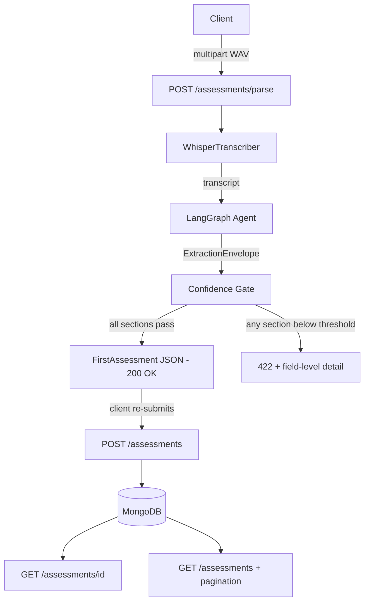

# Clinic Copilot

Clinic Copilot is an AI-powered pipeline that transforms clinician-patient audio recordings into structured clinical assessment reports. 

Built using FastAPI, LangGraph, and Whisper, the pipeline extracts data into a strict schema (matching the Stance Health clinician frontend) and persists it in MongoDB.

## 🏗️ Architecture



---

## ⚡ Tech Stack

| Component | Choice |
| --- | --- |
| **API** | FastAPI + Uvicorn |
| **Transcription** | `faster-whisper` (`base.en`) running on CPU |
| **Agent Workflow** | LangGraph `StateGraph` |
| **Structured Output** | Pydantic v2 |
| **Persistence** | MongoDB (Motor async driver) |
| **LLM Support** | Google Gemini, OpenAI, Groq, **Local (Ollama)** |

---

## 🚀 Setup & Configuration

### 1. Environment Setup
```bash
python3 -m venv .venv
source .venv/bin/activate
pip install -r requirements.txt
```

### 2. Configure `.env`
Copy `.env.example` to `.env` and set your preferred provider.

**To use Google Gemini:**
```env
LLM_PROVIDER=google
GOOGLE_API_KEY="your_api_key_here"
```

**To use a Local Model (via Ollama):**
Ensure Ollama is running (`ollama serve`) and your model is pulled (e.g. `ollama run qwen2.5`).
```env
LLM_PROVIDER=local
LLM_MODEL=qwen2.5
```

### 3. Start MongoDB
You must have a local MongoDB instance running (or update `MONGODB_URI` in `.env` to point to Atlas).
```bash
docker run -d -p 27017:27017 --name stance-mongo mongo:7
```

---

## 🏃 Running the Pipeline

### Start the REST API
```bash
uvicorn app.main:app --reload
```
Interactive Swagger docs available at: `http://127.0.0.1:8000/docs`.

### Test the Extraction Locally (CLI)
You can process a WAV file directly through the CLI without hitting the REST endpoints:
```bash
python scripts/run_pipeline.py path/to/clinical_assessment.wav
```

---

## 🔬 Extraction Results & The Quality Gate

During a test run on a 1-minute 45-second `clinical_assessment.wav` file (post-operative knee assessment), the pipeline produced a 1,825-character transcript using Whisper and passed it to the **Google Gemini** LLM.

### Output JSON
The model perfectly extracted the discussed fields into the strict frontend `FirstAssessment` schema:

```json
{
  "clinicalDetails": {
    "clinicalHistory": "Patient was involved in a road traffic accident 8 months ago resulting in a left tibial condyl fracture and an avulsion ACL tear. Treated with open reduction and internal fixation by Dr. Himant Galyan, followed by 4 to 6 weeks of non-weight bearing and subsequent progressive loading. Has not returned to full functional activity. Provisional diagnosis: left tibial condyl fracture, status post-operative 8 months.",
    "chiefComplaint": "Left knee pain, difficulty performing functional activities, and difficulty walking along with ankle and back pain during prolonged walking. Moderate pain with mild irritability during prolonged walking and standing, relieved with rest.",
    "duration": "8 months"
  },
  "objectiveAssessment": {
    "tests": [
      {
        "testName": "Knee flexion",
        "unitName": "degrees",
        "value": "",
        "left": "124",
        "right": "130",
        "comments": "Restricted and painful on overpressure"
      },
      {
        "testName": "Knee extension",
        "unitName": "degrees",
        "left": "20",
        "right": "-5",
        "comments": "Restricted"
      }
    ]
  },
  "recommendation": [
    {
      "sessionType": "Physiotherapy",
      "sessionFrequency": "Once weekly for four sessions"
    }
  ]
}
```

### 🛡️ Quality Gate (HTTP 422)
The audio provided **did not contain** any mentions of subjective goals, objective goals, or patient advice. Because the AI model was instructed not to hallucinate, it correctly flagged its confidence for those missing fields at `0.20`. 

Since `0.20 < 0.70` (our configured `CONFIDENCE_THRESHOLD`), the pipeline successfully blocked the database save and returned the failing fields. If this occurred on the REST API, it returns an **HTTP 422 Unprocessable Entity**, allowing the clinician UI to prompt the doctor to fill in the missing gaps manually.

```text
Sections below threshold (the API would return HTTP 422):
  subjectiveAssessments: 0.2 < 0.7
  subjectiveGoals: 0.2 < 0.7
  objectiveGoals: 0.2 < 0.7
  patientAdvice: 0.2 < 0.7
```
