# Stance Health - Clinical Assessment Extraction Pipeline

Pipeline that processes clinical audio consultations (WAV) into structured `FirstAssessment` records. It uses Whisper for local speech-to-text, LangGraph for entity extraction, deterministic grounding checks for numeric and temporal measurements, MongoDB for record persistence, and a React web interface for review.

Detailed architecture and workflow documentation is available in [ARCHITECTURE_AND_WORKFLOW.md](ARCHITECTURE_AND_WORKFLOW.md).

---

## Architecture

```mermaid
flowchart LR
    A[WAV upload<br/>multipart/form-data] --> B[Audio Guard<br/>RIFF/WAVE header check, 16kHz mono resample]
    B --> C[Whisper<br/>transcription]
    C --> D{LangGraph}
    D -->|extract| D1[Extract Node<br/>structured LLM call]
    D1 -->|ground| D2[Ground Node<br/>transcript text match]
    D2 -->|normalize| D3[Normalize Node<br/>FirstAssessment schema coercion]
    D3 -->|audit| D4[Audit Node<br/>confidence scoring]
    D4 --> E{overall confidence<br/>>= threshold?}
    E -->|no| F[422 Unprocessable Entity<br/>field flags]
    E -->|yes| G[FirstAssessment JSON<br/>exact schema]
    G --> H[(MongoDB)]
    H --> I[FastAPI read endpoints]
    I --> J[React Report UI]
    G -. confidence headers .-> J
```



Transcription runs before the LangGraph agent because speech-to-text is a deterministic, linear step. The state graph begins once text is available to extract, verify, and validate against the schema.

### Services

| Service | Port | Stack | Role |
|---|---|---|---|
| **`app`** | `8000` | FastAPI, Whisper, LangGraph, Pydantic v2 | Audio validation, speech-to-text, entity extraction, grounding, REST endpoints |
| **`mongo`** | `27017` | MongoDB 7.0 | Persistence for assessment records and audit history |
| **`frontend`** | `3000` | React 18, Vite, TypeScript | Audio upload, waveform inspection, report view, and evidence rail |

---

## Quickstart

### Automated Scripts

Root scripts detect whether Docker is running:
- **Docker running**: starts containers via `docker compose up -d --build`.
- **Docker not running**: runs FastAPI locally on port `8000` (via `.venv`) and frontend on port `3000`.

| Platform | Start | Stop | Clean |
|---|---|---|---|
| **Linux / macOS** | `./start.sh` | `./stop.sh` | `./clean.sh` |
| **Windows (PowerShell)** | `.\start.ps1` | `.\stop.ps1` | `.\clean.ps1` |
| **Windows (CMD)** | `start.bat` | `stop.bat` | `clean.bat` |

---

### Manual Setup

#### Option 1: Local Environment

1. **Backend**:
   ```bash
   python -m venv .venv
   source .venv/bin/activate       # On Windows: .\.venv\Scripts\activate
   pip install -r requirements.txt
   uvicorn app.main:app --host 0.0.0.0 --port 8000 --reload
   ```
   API runs at `http://localhost:8000` (docs at `/docs`).

2. **Frontend**:
   ```bash
   cd frontend
   npm install
   npm run dev
   ```
   UI runs at `http://localhost:3000`.

#### Option 2: Docker Compose

```bash
docker compose up --build
```
This builds and starts the FastAPI backend and MongoDB. First-time image build takes 3–5 minutes because PyTorch, Whisper weights, and MongoDB are downloaded (~2.5 GB total). Subsequent boots are cached and start immediately.

Start the frontend in a separate terminal:
```bash
cd frontend && npm install && npm run dev
```

---

## Configuration (`.env`)

A default `.env` template is included at the repository root. Configure your selected LLM provider:

### 1. Google Gemini (Cloud)
```ini
LLM_PROVIDER=gemini
GEMINI_API_KEY=your_key_here
GEMINI_MODEL=gemini-1.5-flash
```

### 2. Ollama (100% Offline / Local)
Runs fully offline with no API key or external calls:
```ini
LLM_PROVIDER=ollama
OLLAMA_BASE_URL=http://localhost:11434
OLLAMA_MODEL=llama3:latest
```

### 3. OpenAI
```ini
LLM_PROVIDER=openai
OPENAI_API_KEY=sk-...
OPENAI_MODEL=gpt-4o-mini
```

### 4. Anthropic
```ini
LLM_PROVIDER=anthropic
ANTHROPIC_API_KEY=sk-ant-...
ANTHROPIC_MODEL=claude-3-haiku-20240307
```

### Pipeline Settings

| Variable | Default | Description |
|---|---|---|
| `CONFIDENCE_THRESHOLD` | `0.70` | Acceptance threshold for overall session confidence |
| `WHISPER_MODEL` | `base` | Model size for local Whisper speech-to-text (`tiny`, `base`, `small`, `medium`) |
| `MONGODB_URL` | `mongodb://localhost:27017` | Mongo connection string (overridden to `mongodb://mongo:27017` in Docker) |

---

## CLI Execution

To process a WAV file directly without starting servers:

```bash
python scripts/run_pipeline.py clinical_assessment.wav -o output_assessment.json --save-transcript transcript.txt
```

- Exit code `0`: Extraction completed and passed confidence threshold.
- Exit code `2`: Extraction completed but failed confidence threshold or grounding checks.
- Exit code `1`: Execution error (missing file, unreadable audio).

---

## API Endpoints

| Method | Route | Status | Description |
|---|---|---|---|
| `GET` | `/` | 200 | Health status and route listing |
| `GET` | `/health` | 200 | Liveness check |
| `POST` | `/assessments/parse` | 200 | Processes uploaded WAV into bare `FirstAssessment` JSON. Confidence and latency metrics are sent via headers (`X-Extraction-Confidence`, `X-Extraction-Model`, `X-Pipeline-Latency-Ms`). |
| `POST` | `/assessments/parse` | 400 | Non-WAV or malformed audio rejected at header guard |
| `POST` | `/assessments/parse` | 422 | Session confidence below threshold; returns `ConfidenceReport` with ungrounded flags |
| `POST` | `/assessments` | 201 | Persists a validated assessment to MongoDB |
| `GET` | `/assessments/{id}` | 200 | Retrieves an assessment record with its stored audit report |
| `GET` | `/assessments` | 200 | Paginated assessments (`?from=&to=&limit=20&skip=0`) |

---

## Engineering Details

### Contract Isolation
Downstream clients require an exact `FirstAssessment` payload. To avoid schema breakage:
- Response body on `POST /assessments/parse` contains only fields defined in `FirstAssessment` (`extra="forbid"` on all nested models, null strings normalized to `""`, null arrays to `[]`).
- Confidence scores and latency metrics are passed via HTTP response headers and stored in MongoDB under `AssessmentRecord.meta`.

### Deterministic Grounding
LLMs can self-report high confidence on hallucinated measurements. To prevent this:
- Every extracted numeric value (ROM degrees, pain scale scores) and temporal phrase (durations, dates) is cross-checked against the transcript using digit and spoken number-word search (`"52"` and `"fifty two"`).
- Proximity search matches values against anatomical anchors (e.g. searching for `"124"` near `"flexion"`).
- **Fusion rule**:
  $$\text{fused\_confidence} = \begin{cases} \min(\text{llm\_confidence}, 0.35) & \text{if ungrounded numeric/date} \\ \text{llm\_confidence} & \text{otherwise} \end{cases}$$
- **Minimum aggregation**: Overall session confidence is the minimum fused score among populated fields. A single hallucinated number fails the session rather than being averaged out by narrative fields.

### FFmpeg-Free Audio Decoding
Audio is decoded and resampled using `soundfile` and `scipy.signal.resample_poly` to 16 kHz mono. This avoids requiring a system `ffmpeg` binary in the host environment.

---

## UI Walkthrough

### 1. Initialization
Session audio upload interface supporting standard PCM WAV files:


### 2. Processing
Audio waveform visualizer and real-time pipeline execution checklist:


### 3. Results
Structured assessment output (left) with extraction audit and transcript evidence rail (right):


---

## Tests

Run the test suite:

```bash
# Unit, schema, and API tests
python -m pytest tests/test_schema.py tests/test_grounding.py tests/test_pipeline.py tests/test_api.py -v

# Golden-path test on sample audio
python -m pytest tests/test_e2e_live.py -v -m "not live"
```

---

## Limitations

1. **Narrative Grounding**: Free-text sections (`chiefComplaint`, `adviceDetails`) rely on token overlap and model self-reporting; they are not deterministically verifiable like numeric degrees.
2. **Medical Eponyms**: Standard Whisper models may occasionally mishear unfamiliar orthopaedic terms or surgeon names. Initial prompt hints mitigate this.
3. **Speaker Diarization**: Multi-speaker conversations are transcribed as a single interleaved stream.
