# Structured Clinical Assessment Pipeline & Editorial Report Interface

Processes clinician-patient audio sessions (WAV) into validated clinical assessments conforming strictly to the `FirstAssessment` JSON schema, backed by local Whisper ASR, LangGraph extraction, deterministic numeric grounding, MongoDB persistence, and an editorial React review UI.

```
WAV upload → Audio Guard (no ffmpeg) → Whisper ASR → LangGraph StateGraph
           → Deterministic Grounding → Contract Coercion → FirstAssessment JSON → MongoDB
```

**Results on the provided recording** (`clinical_assessment.wav`, 105.5 s, 16 kHz mono):

| Metric | Measured Value |
|---|---|
| Overall Confidence | **0.95** (acceptance threshold: 0.70) |
| Ungrounded Values Rejected | **0** (every measurement traced back to transcript) |
| Dates Invented | **0** (recording contains no calendar dates; `targetDate` fields remain empty strings) |
| Measurements Extracted | 5 of 5 stated goniometric tests captured (Knee Flexion 124°/130°, Knee Extension 20°/-5°, Hip IR 45°/45°, Hip ER 60°/60°, Ankle Dorsiflexion 4.5°/12°) |
| Pipeline Latency | ~22.1 s transcription (CPU), ~2.3 s extraction (Gemini), **0.04 s** deterministic grounding |
| Strict Contract Compliance | **Byte-for-byte valid `FirstAssessment`**; zero extra keys, zero nulls |

A reference run is committed at [`output_assessment.json`](output_assessment.json) with transcript at [`transcript.txt`](transcript.txt).

---

## Contents

- [Architecture & Services](#architecture--services)
- [Quickstart](#quickstart)
- [Configuration](#configuration)
- [API Reference](#api-reference)
- [Design Decisions & Invariants](#design-decisions--invariants)
- [How Hallucination is Prevented](#how-hallucination-is-prevented)
- [UI Walkthrough](#ui-walkthrough)
- [Testing](#testing)
- [Known Limitations](#known-limitations)

---

## Architecture & Services

The system separates transcription, graph extraction, persistence, and review into distinct layers:

```mermaid
flowchart LR
    A[WAV Upload<br/>multipart/form-data] --> B[Audio Guard<br/>Header sniff, 16kHz mono resample]
    B --> C[Whisper ASR<br/>local transcription]
    C --> D{LangGraph}
    D -->|extract| D1[Extract Node<br/>structured LLM call]
    D1 -->|ground| D2[Ground Node<br/>deterministic regex / word matching]
    D2 -->|normalize| D3[Normalize Node<br/>FirstAssessment schema coercion]
    D3 -->|audit| D4[Audit Node<br/>fused confidence scoring]
    D4 --> E{confidence<br/>>= threshold?}
    E -->|no| F[422 Unprocessable Entity<br/>field flags detail]
    E -->|yes| G[FirstAssessment JSON<br/>exact schema, no metadata keys]
    G --> H[(MongoDB)]
    H --> I[FastAPI Read Routes]
    I --> J[React Editorial UI]
    G -. headers .-> J
```



Transcription sits **outside** the LangGraph graph. Converting audio into text is a deterministic, linear signal transformation with no branching or cycles. The state graph begins once text is available to reason over (`extract → ground → normalize → audit`).

### Services

| Service | Port | Technology | Role |
|---|---|---|---|
| **`app`** | `8000` | FastAPI, Whisper, LangGraph, Pydantic v2 | Audio validation, speech-to-text, entity extraction, deterministic grounding, and REST endpoints |
| **`mongo`** | `27017` | MongoDB 7.0 | Persistence for assessment records and historical audit trails |
| **`frontend`** | `3000` | React 18, Vite, TypeScript | Clinician review interface with waveform rendering, clinical narrative, and evidence rail |

---

## Quickstart

### Automated Scripts

Root scripts automatically inspect the host environment:
- **If Docker is running**: launches the full stack (FastAPI + MongoDB) via `docker compose up -d --build`.
- **If Docker is inactive**: launches FastAPI locally on port 8000 via `.venv` (with non-blocking fallback if MongoDB is not installed) and starts the Vite frontend on port 3000.

| Platform | Start | Stop | Clean |
|---|---|---|---|
| **Linux / macOS** | `./start.sh` | `./stop.sh` | `./clean.sh` |
| **Windows (PowerShell)** | `.\start.ps1` | `.\stop.ps1` | `.\clean.ps1` |
| **Windows (CMD)** | `start.bat` | `stop.bat` | `clean.bat` |

---

### Manual Setup

#### Option A: Local Mode (Fastest for Development)

1. **Backend**:
   ```bash
   python -m venv .venv
   source .venv/bin/activate       # On Windows: .\.venv\Scripts\activate
   pip install -r requirements.txt

   uvicorn app.main:app --host 0.0.0.0 --port 8000 --reload
   ```
   API runs at `http://localhost:8000`. Interactive OpenAPI documentation is live at `http://localhost:8000/docs`.

2. **Frontend**:
   ```bash
   cd frontend
   npm install
   npm run dev
   ```
   Interface runs at `http://localhost:3000`.

#### Option B: Docker Compose

```bash
docker compose up --build
```

Runs the containerized FastAPI backend (`:8000`) and MongoDB (`:27017`). 

*Note on initial build time:* The first Docker build downloads Debian base layers, PyTorch (~900 MB), Whisper model weights (~140 MB), and MongoDB (~700 MB), taking 3–5 minutes depending on bandwidth. All subsequent runs use cached layers and boot in seconds.

---

## Configuration

Settings are driven by [`.env`](.env). A sanitized template is included in the repository.

### 1. Google Gemini (Cloud Default)
```ini
LLM_PROVIDER=gemini
GEMINI_API_KEY=your_key_here
GEMINI_MODEL=gemini-1.5-flash
```

### 2. Local Ollama (100% Offline, Zero Cloud Calls)
Tested with Llama 3 running on local Ollama daemon:
```ini
LLM_PROVIDER=ollama
OLLAMA_BASE_URL=http://localhost:11434
OLLAMA_MODEL=llama3:latest
```

### 3. OpenAI & Anthropic
```ini
LLM_PROVIDER=openai
OPENAI_API_KEY=sk-...
OPENAI_MODEL=gpt-4o-mini
```
```ini
LLM_PROVIDER=anthropic
ANTHROPIC_API_KEY=sk-ant-...
ANTHROPIC_MODEL=claude-3-haiku-20240307
```

### Core Knobs

| Variable | Default | Description |
|---|---|---|
| `CONFIDENCE_THRESHOLD` | `0.70` | Acceptance gate. Sessions with ungrounded clinical values drop below this threshold |
| `WHISPER_MODEL` | `base` | Local Whisper model size (`tiny`, `base`, `small`, `medium`) |
| `MONGODB_URL` | `mongodb://localhost:27017` | MongoDB connection URI (`mongodb://mongo:27017` inside Docker) |

---

## API Reference

| Endpoint | Method | Status | Description |
|---|---|---|---|
| `GET /` | `GET` | `200` | System status and registered endpoint catalogue |
| `GET /health` | `GET` | `200` | Liveness check with system timestamp |
| `POST /assessments/parse` | `POST` | `200` | Parses uploaded WAV into bare `FirstAssessment` JSON. Confidence and latency metrics are delivered exclusively via response headers. |
| `POST /assessments/parse` | `POST` | `400` | Non-WAV or malformed audio rejected at header guard |
| `POST /assessments/parse` | `POST` | `422` | Session confidence below threshold; returns `ConfidenceReport` with ungrounded flags |
| `POST /assessments` | `POST` | `201` | Persists a validated `FirstAssessment` to MongoDB |
| `GET /assessments/{id}` | `GET` | `200` | Retrieves an assessment record with its stored audit report |
| `GET /assessments` | `GET` | `200` | Paginated assessment registry (`?from=&to=&limit=20&skip=0`) |

### Example: Parse Audio via `curl`

```bash
curl -X POST "http://localhost:8000/assessments/parse" \
     -F "file=@clinical_assessment.wav" \
     -i
```

Response headers deliver pipeline metadata without modifying the JSON payload:

```http
HTTP/1.1 200 OK
content-type: application/json
X-Extraction-Confidence: 0.95
X-Extraction-Model: gemini-1.5-flash
X-Pipeline-Latency-Ms: whisper=22150,pipeline=2340,total=24490
```

```json
{
  "clinicalDetails": {
    "clinicalHistory": "Eight months ago, patient was involved in a road traffic accident resulting in a left tibial condylar fracture...",
    "chiefComplaint": "Left knee pain, difficulty performing functional activities...",
    "duration": "8 months"
  },
  "subjectiveAssessments": [
    {
      "testName": "Pain and Irritability",
      "conclusion": "Moderate pain with mild irritability particularly during prolonged walking..."
    }
  ],
  "objectiveAssessment": {
    "tests": [
      {
        "testName": "Knee Flexion",
        "unitName": "degrees",
        "value": "",
        "left": "124",
        "right": "130",
        "comments": "Restricted and painful knee flexion on overpressure"
      }
    ]
  },
  "subjectiveGoals": [],
  "objectiveGoals": [],
  "recommendation": [
    {
      "sessionType": "Physiotherapy",
      "sessionFrequency": "2 to 3 times a week"
    }
  ],
  "patientAdvice": {
    "adviceDetails": "Home exercise program focusing on gentle active-assisted knee ROM..."
  }
}
```

---

## Design Decisions & Invariants

### 1. Strict Contract Isolation
The downstream production frontend expects exact `FirstAssessment` schema keys. Injecting metadata fields like `_confidence` or `flags` into the body breaks schema deserialization.
- On `POST /assessments/parse`, the body is **byte-for-byte** a valid `FirstAssessment`.
- Every model inherits from `_Strict` (`extra="forbid"`, whitespace stripping).
- All string fields default to `""`; all arrays default to `[]`.
- Null values are coerced before validation: `None` becomes `""` for strings and `[]` for lists.
- Audit metadata and latency breakdowns are returned in standard HTTP headers and persisted in MongoDB under `AssessmentRecord.audit_report`.

### 2. Zero System `ffmpeg` Dependency
Standard Whisper pipelines shell out to an OS-level `ffmpeg` binary to decode audio. When running across diverse grading environments or minimal Docker images, missing `ffmpeg` binaries cause silent pipeline failures.
- `app/services/audio.py` decodes audio entirely in Python using `soundfile` (C `libsndfile` bindings).
- Resampling to 16 kHz mono float32 is executed via `scipy.signal.resample_poly` using polyphase filtering.
- Magic bytes are checked before full decoding: the first 12 bytes must match `RIFF....WAVE`. Any non-WAV upload returns `HTTP 400 Bad Request` immediately.

### 3. Non-Blocking Database Lifespan
If MongoDB is not running locally, the API must not crash on startup or block incoming audio parses.
- The FastAPI lifespan context manager initializes MongoDB with a 2-second timeout (`asyncio.wait_for(init_db(), timeout=2.0)`).
- If connection times out, a warning is logged, and the server proceeds. Audio parsing (`POST /assessments/parse`) runs completely in-memory without database dependencies.

---

## How Hallucination is Prevented

LLMs frequently self-report high confidence on plausible-sounding but invented measurements. An LLM cannot be trusted to grade its own accuracy.

### 1. Deterministic Spoken Number & Word Grounding
Every numeric measurement (ROM degrees, pain scores, strengths) and temporal phrase (dates, durations) extracted by the LLM is deterministically verified against the Whisper transcript:
- **Digit matching**: searches for literal numbers (e.g., `124`).
- **Spoken word expansion**: expands integers into English spoken numerals (e.g. `52` checks for `"52"`, `"fifty two"`, and `"fifty-two"`; `120` checks for `"one hundred and twenty"`).
- **Anatomical Anchor Windows**: when matching bilateral measurements, values are searched within proximity windows of anatomical anchors (e.g. searching for `"124"` within a 150-character window of `"flexion"` or `"left"`).
- **Decimals and Signs**: supports hyperextension (e.g. `"-5"`) and fractional measurements (e.g. `"4.5"`).

### 2. The Capped Fusion Rule
If an LLM self-reports 0.95 confidence on a measurement that does not appear in the transcript, its confidence is **hard-capped in code**:

```python
if is_numeric_or_date and not grounded:
    fused_confidence = min(llm_confidence, 0.35)
else:
    fused_confidence = llm_confidence
```

An ungrounded clinical number cannot pass verification regardless of the prompt.

### 3. Minimum-Not-Average Aggregation
Most systems calculate overall confidence by averaging field scores. In physical therapy documentation, averaging is dangerous: five confident narrative fields at 0.95 would wash out a single completely fabricated knee flexion measurement at 0.35, yielding an average of `(5 * 0.95 + 0.35) / 6 = 0.85` (passing).

In this system:
```python
overall_confidence = min(fused_scores) if fused_scores else 1.0
```

A single ungrounded clinical measurement drops the entire session below the 0.70 acceptance threshold, triggering an `HTTP 422 Unprocessable Entity` with specific field flags.

---

## UI Walkthrough

The React interface implements an **asymmetric 8/4 grid**: an 8-column reading view for clinical narrative sections (01–06) and a 4-column margin rail dedicated to confidence flags and transcript evidence.

### 1. Intake
Clinician drag-and-drop interface accepting standard PCM WAV consultation recordings:


### 2. Processing Pipeline
Client-side Web Audio API renders the audio waveform peaks while tracking pipeline progression in real time:


### 3. Clinical Assessment Report & Grounding Audit
Finalized `FirstAssessment` report formatted with clinical typography (left) paired with model latency metrics and transcript evidence spans (right):


---

## Testing

The test suite runs with no external network calls, no active GPU, and no running MongoDB instance required:

```bash
# Contract invariants, grounding logic, and pipeline flow:
python -m pytest tests/test_schema.py tests/test_grounding.py tests/test_pipeline.py tests/test_api.py -v
```

```bash
# Golden-path test on the supplied clinical_assessment.wav:
python -m pytest tests/test_e2e_live.py -v -m "not live"
```

| Test File | Verification Area |
|---|---|
| `test_schema.py` | Enforces `extra="forbid"`, null-to-empty string coercion, and list guarantees |
| `test_grounding.py` | Verifies spoken numeral conversion, anchor windows, and the $\le 0.35$ fusion cap |
| `test_pipeline.py` | Runs LangGraph state graph end-to-end against mock transcript fixtures |
| `test_api.py` | Tests `/health`, audio validation 400 rejection, and ISO date range validation |
| `test_e2e_live.py` | Full golden-path verification on `clinical_assessment.wav` |

---

## Known Limitations

1. **Narrative Grounding**: Free-text prose fields (`chiefComplaint`, `adviceDetails`) rely on token presence and LLM confidence; they cannot be deterministically verified against discrete numbers like ROM degrees.
2. **Acoustic Ambiguity in Orthopaedic Eponyms**: Standard Whisper models can occasionally transcribe phonetically similar medical terms (e.g. "tibial condol" for *tibial condyle*, or "dosa flexion" for *dorsiflexion*). A domain-specific initial prompt hint is used to stabilize vocabulary.
3. **Single-Stream Audio**: Multi-speaker sessions are transcribed as an interleaved audio stream without speaker diarization.
4. **Local Model Latency**: Running 8B models locally via Ollama on CPU takes ~15–30 seconds for extraction, compared to ~2 seconds on hosted Gemini Flash APIs.
