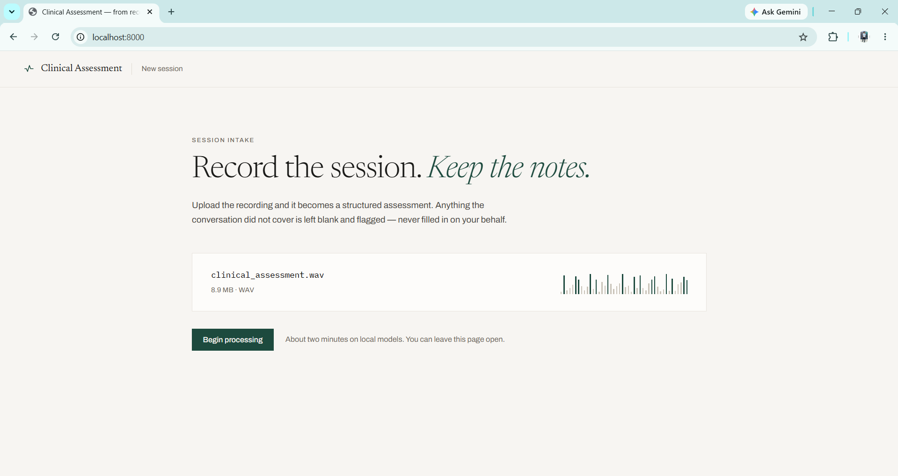
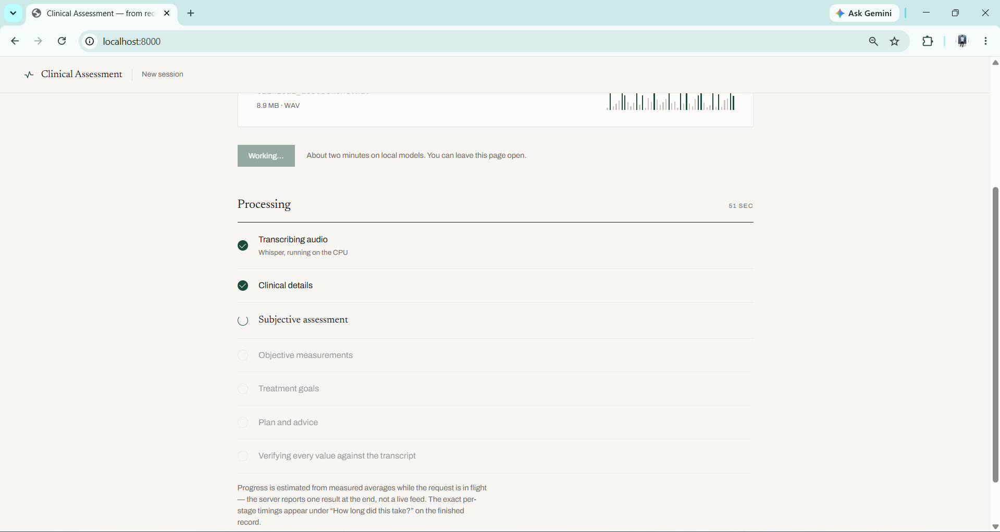
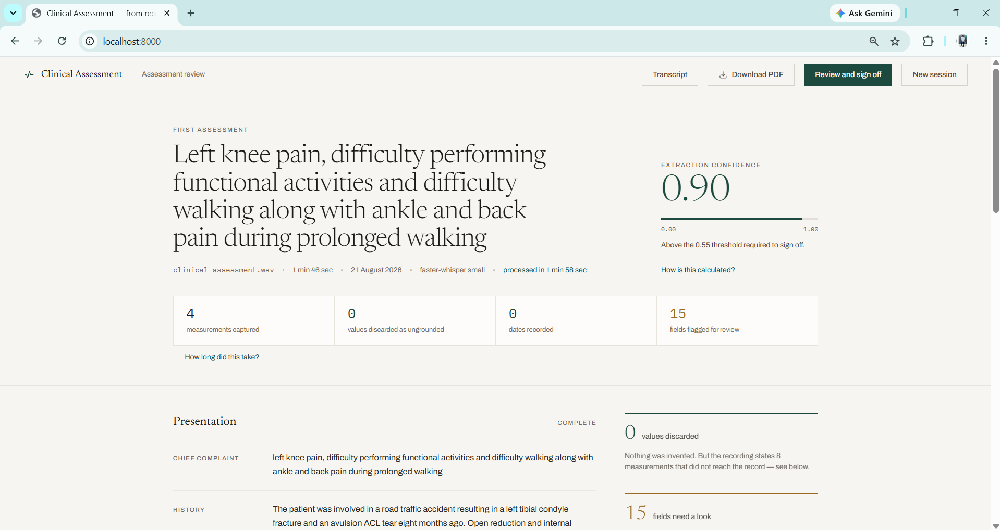
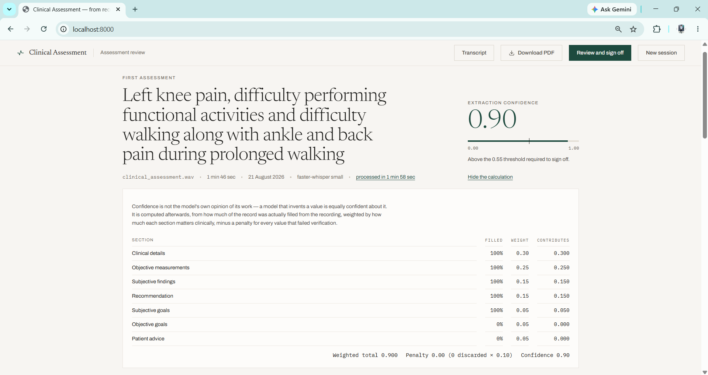
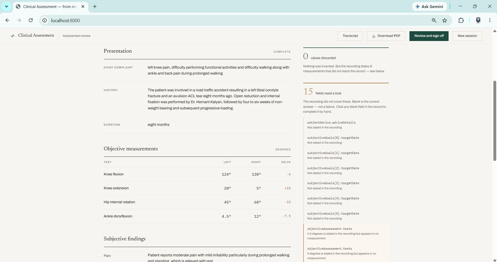
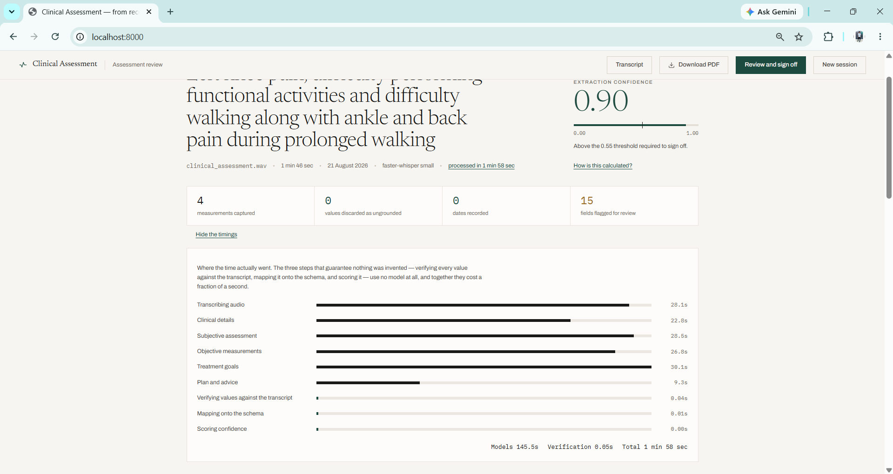
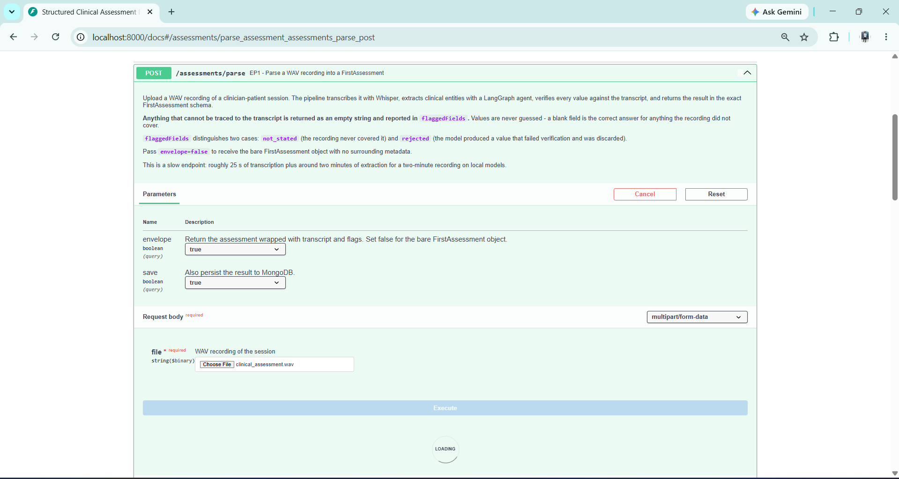

# Structured Clinical Assessment Form Filler

Turns a WAV recording of a clinician–patient session into a structured clinical
assessment in the exact `FirstAssessment` schema, and stores it in MongoDB.

```
WAV upload → Whisper transcription → LangGraph extraction
           → grounding verification → FirstAssessment JSON → MongoDB
```

**Result on the supplied recording** (`data/clinical_assessment.wav`, 105.5 s):

| | |
|---|---|
| Confidence | **0.90** (threshold 0.55) |
| Values rejected as ungrounded | **0** |
| Dates invented | **0** — the recording contains none, and every `targetDate` is empty |
| Measurements captured | 4 of the 5 stated; the 5th is **flagged as missed**, not silently dropped |
| End to end | ~165 s (29 s transcription, 135 s extraction, **0.03 s** verification) |
| Tests | **188 passing**, no models or database server required |

A full run is committed at [`data/sample_output.json`](data/sample_output.json).

---

## Contents

- [Setup](#setup)
- [Running it](#running-it)
- [API](#api)
- [Architecture](#architecture)
- [Design decisions](#design-decisions)
- [How hallucination is prevented](#how-hallucination-is-prevented)
- [Testing](#testing)
- [Known limitations](#known-limitations)

---

## Setup

**Requirements:** Python 3.10+, MongoDB, and either a local Ollama install or an
API key. No `ffmpeg` is needed — audio decoding is done in-process.

### 1. Install

```bash
python -m venv .venv
.venv\Scripts\activate          # Windows;  source .venv/bin/activate on Unix
pip install -r requirements.txt
cp .env.example .env
```

`requirements.txt` is deliberately torch-free: `faster-whisper` runs the OpenAI
Whisper weights through CTranslate2, so there is no 250 MB torch wheel and no
ffmpeg binary to install.

### 2. MongoDB

Any MongoDB reachable at `MONGODB_URI` works, including Atlas. To run one
locally without an installer or admin rights, download the MongoDB Community
**zip** (not the MSI), extract it, and start it against a data directory:

```bash
mongod --dbpath /path/to/data --logpath /path/to/log/mongod.log --port 27017
```

> Keep the data directory **outside any synced folder** (OneDrive, Dropbox). A
> live WiredTiger database inside one produces file-lock errors and sync
> conflicts.

### 3. The extraction model

Default is local Ollama, which needs no API key:

```bash
ollama pull qwen2.5:3b-instruct
```

To use a hosted model instead, install the extras and set two variables:

```bash
pip install -r requirements-optional.txt
```

> **If you also want the `openai-whisper` backend**, that one package needs a
> different command — see [Known limitations](#known-limitations).

```ini
LLM_PROVIDER=anthropic
ANTHROPIC_API_KEY=sk-ant-...
```

### 4. Check everything is wired up

```bash
uvicorn app.main:app --reload
curl http://localhost:8000/health
```

```json
{"status": "ok", "mongodb": true, "llmProvider": "ollama",
 "llmModel": "qwen2.5:3b-instruct", "llmReachable": true,
 "whisperBackend": "faster", "whisperModel": "small", "whisperLoaded": false}
```

---

## Running it

### The test script (D5)

```bash
python scripts/run_pipeline.py                 # the supplied recording
python scripts/run_pipeline.py --file other.wav
python scripts/run_pipeline.py --raw           # bare FirstAssessment only
python scripts/run_pipeline.py --save          # also persist to MongoDB
python scripts/run_pipeline.py --cached        # reuse the cached transcript
python scripts/run_pipeline.py > out.json      # JSON to stdout, report to stderr
```

The assessment JSON goes to **stdout** and the progress report to **stderr**, so
output can be piped into `jq` without commentary in the way. The exit code is
non-zero when confidence falls below the threshold — the same condition that
makes the API return 422 — so CI can assert on a run without parsing it.

The report highlights the two things that are hard to see in raw JSON:

```
--- ANTI-HALLUCINATION (S6) ---------------------------------------
No values were rejected - every extracted value traced to the transcript.

--- FLAGGED FIELDS (S5) -------------------------------------------
  [not_stated] patientAdvice.adviceDetails
  [not_stated] objectiveGoals[0].targetDate
  ...
```

`--cached` skips transcription, which turns a 141 s iteration into a 105 s one
when working on extraction prompts.

### The server

```bash
uvicorn app.main:app --reload
```

Then open **http://localhost:8000** for the clinician interface: upload a
recording, watch the pipeline run, review the record with flagged fields
highlighted, export it as a PDF, and sign it off. Blank fields the recording
could not supply are editable in place, and anything typed is marked as
clinician-entered rather than extracted.

**http://localhost:8000/docs** is the same API in Swagger, for exercising the
four endpoints directly.

---

## API

| | Endpoint | Purpose |
|---|---|---|
| EP1 | `POST /assessments/parse` | WAV upload → `FirstAssessment` JSON |
| EP2 | `POST /assessments` | Persist a parsed result |
| EP3 | `GET /assessments/{id}` | Retrieve by id |
| EP4 | `GET /assessments` | List all, filterable by date |
| — | `GET /health` | Dependency reachability |
| — | `GET /` | Clinician interface (static, no build step) |

### EP1 — parse

```bash
curl -X POST "http://localhost:8000/assessments/parse" \
     -F "file=@data/clinical_assessment.wav"
```

Returns an envelope: `assessment` (exactly the seven schema keys) alongside
`transcript`, `confidence`, `flaggedFields` and `timings`.

```jsonc
{
  "assessment": { /* exactly 7 keys, nothing else */ },
  "transcript": { "text": "...", "language": "en", "durationSeconds": 105.55 },
  "confidence": { "overall": 0.9, "threshold": 0.55, "meetsThreshold": true },
  "flaggedFields": [
    { "path": "objectiveGoals[0].targetDate", "reason": "not_stated", "detail": "" }
  ],
  "timings": { "transcribe": 29.3, "total": 105.0 }
}
```

Options:

- `?envelope=false` — return the bare `FirstAssessment` object with no wrapper
- `?save=true` — persist in the same call

### EP2 — save

```bash
curl -X POST "http://localhost:8000/assessments" \
     -H "Content-Type: application/json" \
     -d '{"assessment": { ... }, "metadata": {"sourceFilename": "session.wav"}}'
```

### EP3 — retrieve

```bash
curl "http://localhost:8000/assessments/6a87251b017ed668599e5a45"
```

### EP4 — list

```bash
curl "http://localhost:8000/assessments?from=2026-08-01&to=2026-08-20&limit=20"
```

`from` and `to` accept a date or a full timestamp. A bare `to` date includes
that whole day.

### Status codes

| Code | When |
|---|---|
| `400` | Upload is empty or is not a readable PCM WAV |
| `413` | Upload exceeds `MAX_UPLOAD_BYTES` |
| `422` | **Confidence below threshold**, with field-level detail — or a request body that violates the schema |
| `404` | Unknown *or* malformed assessment id |
| `503` | Whisper, the LLM provider, or MongoDB is unreachable |

The 422 body carries the transcript and the partial assessment as well as the
failing fields, because a clinician judging a rejected parse needs to see what
was heard before deciding whether to retry or complete it by hand:

```jsonc
{
  "detail": {
    "message": "Extraction confidence 0.12 is below the required threshold 0.55...",
    "confidence": 0.12,
    "threshold": 0.55,
    "fields": [{"path": "clinicalDetails.chiefComplaint", "reason": "not_stated"}],
    "transcript": "...",
    "assessment": { /* partial, still schema-valid */ }
  }
}
```

---

## Architecture

```
app/
├── main.py                       FastAPI app, lifespan, request logging
├── config.py                     all settings, from environment
├── api/
│   ├── routes.py                 the four endpoints
│   └── schemas.py                request/response envelopes
├── transcription/
│   ├── audio_io.py               WAV → 16 kHz mono float32, no ffmpeg
│   └── whisper_service.py        swappable Whisper backends
├── extraction/
│   ├── llm.py                    provider factory + structured output
│   ├── prompts.py                per-section prompts and models
│   ├── graph.py                  the LangGraph agent
│   ├── grounding.py              anti-hallucination verification
│   └── confidence.py             scoring and field flagging
├── db/
│   ├── client.py                 connection lifecycle
│   ├── models.py                 stored document shape
│   └── repository.py             save / get / list
└── schemas/
    └── first_assessment.py       THE CONTRACT — 7 sections
```

### The extraction graph

```
extract_clinical_details → extract_subjective → extract_objective
    → extract_goals → extract_plan
    → verify_grounding   (no LLM)
    → assemble           (no LLM)
    → score_confidence   (no LLM)
```

The last three nodes use no model at all. They are pure functions of the
transcript and the extracted values, which is what makes the "nothing was
invented" guarantee testable rather than aspirational.

---

## Design decisions

### The schema contract is enforced structurally

The brief states three rules for the output. Each is enforced by the type
system rather than by convention, because a violation breaks the live frontend
and would otherwise only surface there:

| Rule | Enforcement |
|---|---|
| No extra fields, no renamed keys | `extra="forbid"` on every model — a typo like `chiefComplaints` raises |
| Array fields are always arrays | `None` → `[]`, and a lone object is wrapped |
| String fields are never null | `None` → `""`, and bare numbers are coerced to strings |

The contract tests transcribe the expected shape **from the brief by hand**
rather than generating it from the model. A generated fixture would rubber-stamp
any drift; a hand-written one fails when the model changes.

Two coercions look like leniency but prevent real failures. A lone object is
wrapped into an array because the brief requires an array "even if only one item
is present". Bare numbers become strings because Pydantic v2 does **not** coerce
`int` → `str`, and a model reading "120 degrees" routinely emits `120`.

### Confidence flags live outside the assessment

`FirstAssessment` forbids extra keys, so S5 flags **cannot** live inside it. They
travel as siblings in the response envelope, leaving `assessment` directly
usable by the frontend. `?envelope=false` serves callers who want nothing else,
so both readings of the brief are satisfied rather than one being guessed at.

### faster-whisper by default, openai-whisper available

`WHISPER_BACKEND` selects between them. Both run the same OpenAI Whisper
weights and receive an identical numpy array from one shared decode path, so a
transcript cannot differ between backends because of how the audio was decoded.

The default is `faster-whisper` because it needs no torch and no ffmpeg and runs
around 4× faster on CPU. `WHISPER_BACKEND=openai` runs the reference
implementation for anyone who wants the literal package the brief names —
verified on the supplied recording at 105.5 s of audio in 15.2 s, 24 segments,
and still without ffmpeg, because the decoded array goes straight to the model.

Installing that one package needs a specific command:

```bash
pip install "setuptools<81"
pip install --no-build-isolation openai-whisper==20240930
```

A plain `pip install` fails: `openai-whisper`'s build imports `pkg_resources`,
which setuptools removed in version 81, and pip's isolated build environment
supplies its own current setuptools regardless of what the virtualenv holds —
so the pin only takes effect with `--no-build-isolation`.

### No ffmpeg

`openai-whisper` normally shells out to ffmpeg to decode audio. Rather than add
a system dependency, `audio_io.py` decodes WAV with the stdlib `wave` module and
numpy, and resamples by spectral truncation — an ideal brick-wall low-pass, so
44.1 kHz → 16 kHz introduces no aliasing. This is also why scipy is not a
dependency: resampling was the only thing it would have been needed for.

The resampler is tested **by pitch, not by shape**: a 440 Hz tone must still
read as 440 Hz after resampling. A badly aliasing implementation passes a length
assertion but fails that one.

### Section by section, not one call

The agent runs five focused extraction calls rather than one call for the whole
schema. A small model holds a flat three-field schema reliably and a
seven-section nested one poorly. It also contains failure: if one section never
parses, the rest of the assessment still arrives with that section flagged,
instead of the whole request failing.

### Prompts are questions, not field lists

This was not cosmetic. With `field: description` lists, the model copied a
field's own description back as its value — `clinicalHistory` arrived as *"the
history leading to this presentation, any surgery and by whom…"*. Grounding
caught it and cleared it, but the field was then empty.

Rephrasing each field as a **question**, plus an explicit instruction not to
repeat the questions, took confidence from **0.65 to 0.90** on the same model
and the same recording, and fixed `duration` and `patientAdvice` at the same
time.

### One structured-output path for every provider

`with_structured_output` resolves to native tool-calling on Anthropic and OpenAI
but degrades badly on a local 3B model, which is the default here. Instead every
provider goes through one path: ask for JSON, parse it, validate against
Pydantic, and on failure feed the validation error back for a repair attempt.
That behaves identically across providers, keeps the raw response available for
debugging, and makes the agent testable with a stub LLM that needs no network.

### Local-first, provider-swappable

The default runs entirely offline with no API key, so the project works with no
account and no per-run cost, and patient audio never leaves the machine.
`LLM_PROVIDER=anthropic` plus a key upgrades extraction quality in one line.

### Objective measurements are normalised in code

`value` is for a measurement with no side; `left`/`right` carry a sided one. A
small model routinely fills both, leaving `value` duplicating `left`. Rather
than prompt-tune a 3B model into compliance, the rule is enforced where it
always holds: if either side is present, `value` is cleared.

### Metadata is stored beside the assessment, never inside it

Flattening confidence and flags into the stored document would make querying
marginally easier and would break the seven-key contract. There is a test
asserting `confidence` does not appear in the stored assessment.

### A malformed id is a 404, not a 500

From outside, "no such id" and "unparseable id" are the same situation. Raising
would turn a client mistake into a server fault.

### Whisper and the LLM run in a threadpool

Both are synchronous and CPU/GPU bound. Calling them inline would block the
event loop for the full two-minute pipeline and stall every other request —
including `/health`, which is what you would be checking when things seem stuck.

### The interface came last, on purpose

The brief lists six deliverables and none is a UI, so `/docs` was the only
interface until D1–D6 were complete. The interface was then built because the
anti-hallucination work is invisible in raw JSON: a reviewer cannot see the
difference between *not stated*, *discarded* and *possibly missed* in a wall of
keys, and those distinctions are the point of the project.

It is static HTML, CSS and JS — no framework, no bundler, no build step — so it
adds no dependency and can be read without a toolchain. PDF export is
`window.print()` against a print stylesheet, which gives a vector PDF with
selectable text and ships nothing.

---

## How hallucination is prevented

Requirement S6 — *never hallucinate clinical values, scores, or dates* — cannot
be guaranteed by prompt wording. Every value the model produces is verified
against the transcript by code that uses no LLM.

A value survives only if **all three** hold:

1. **Numbers** — every number it contains also appears in the transcript
2. **Dates** — every date-like token also appears in the transcript
3. **Lexis** — enough of its content words appear that it reads as a
   transcription rather than an invention

Anything that fails is **cleared to `""` and flagged**, never kept. That is the
deliberate trade: a blank flagged field is safe for a clinician to complete, a
confident wrong measurement is not.

`flaggedFields` separates two very different situations:

| Reason | Meaning |
|---|---|
| `not_stated` | The recording never covered this field. Benign and expected. |
| `rejected` | The model produced a value that failed verification. A caught hallucination; the discarded value is included for audit. |

### Why not evidence quotes

An earlier design asked the model for a verbatim quote supporting each field.
It was dropped: a model willing to invent a measurement will equally invent a
quote supporting it, and it doubled output tokens on a 3B model. Checking values
directly against the transcript trusts the model with nothing.

### Two normalisations prevent false rejections

Over-strict grounding is its own failure mode. Both of these were found by
running against the real recording:

- Spoken numbers map to digits, so `"8 months"` grounds against the spoken
  *"eight months"*
- The degree sign expands to the word, so `unitName: "degrees"` grounds against
  `124°` — without this, every correct unit would have been discarded

### The evidence

The supplied recording contains **no dates at all**. Every `targetDate` in the
committed sample output is empty, and a test asserts it. That is a real
transcript, not a constructed fixture, which makes it the strongest evidence
here that the guard works.

---

## Testing

```bash
pytest                          # 188 tests, ~8 seconds
pytest tests/test_grounding.py  # the S6 proof
```

The suite needs **no Whisper model, no Ollama daemon, no GPU and no MongoDB
server** — the LLM is stubbed and MongoDB is `mongomock`. The same repository
code was additionally verified against a live MongoDB 7.0.14 during development.

| File | Covers |
|---|---|
| `test_schema_contract.py` | The seven-key contract, all three rules, round-trip stability |
| `test_audio_io.py` | Resampling correctness by pitch, sample widths, rejection paths |
| `test_grounding.py` | **S6** — invented numbers, dates and prose are stripped |
| `test_confidence.py` | Scoring, thresholds, `not_stated` vs `rejected` |
| `test_extraction_graph.py` | The agent end to end, failure containment |
| `test_repository.py` | Save, retrieve, date filtering, paging |
| `test_api.py` | All four endpoints including 400/404/413/422/503 |
| `test_pipeline_script.py` | The D5 script and the committed sample output |

---

## Screenshots

A full run of the pipeline, from upload to signed record. Source media lives in
[`docs/`](docs/).

### Intake



### The pipeline running



Progress is estimated while the request is in flight — the server returns one
result at the end rather than a live feed — and the exact per-stage timings
appear on the finished record.

### The record



### How the confidence score is derived



Confidence is not the model's own opinion of its work. It is computed
afterwards from how much of the record was filled from the recording, weighted
by clinical importance, minus a penalty per value that failed verification.

### Fields needing review



Three distinct states, and the difference between them is the point of the
project: `not_stated` (the recording never covered it), `rejected` (a value the
model produced that could not be traced back), and `possibly_missed` (a
measurement the recording states that reached no field).

### Where the time goes



The three steps that guarantee nothing was invented use no model and cost a
fraction of a second against roughly two minutes of inference.

### The API



### Video and exported report

- [`docs/demo.mp4`](docs/demo.mp4) — a full run end to end
- [`docs/sample-report.pdf`](docs/sample-report.pdf) — a PDF exported from the
  app, including the appendix that names every flagged field and why it is
  blank

---

## Configuration

Everything is environment-driven; see [`.env.example`](.env.example).

| Variable | Default | Notes |
|---|---|---|
| `WHISPER_BACKEND` | `faster` | `faster` or `openai` |
| `WHISPER_MODEL` | `small` | `tiny` … `large-v3` |
| `WHISPER_DEVICE` | `cpu` | Keep on CPU if the GPU holds the LLM |
| `LLM_PROVIDER` | `ollama` | `ollama`, `anthropic`, `openai` |
| `LLM_MODEL` | `qwen2.5:3b-instruct` | Must fit your GPU — see below |
| `LLM_TEMPERATURE` | `0.0` | Deterministic; do not raise |
| `CONFIDENCE_THRESHOLD` | `0.55` | Below this, EP1 returns 422 |
| `MONGODB_URI` | `mongodb://localhost:27017` | Atlas URIs work unchanged |
| `MONGODB_DB` | `clinical_assessments` | Database name |
| `WHISPER_COMPUTE_TYPE` | `int8` | `int8` is ~4× faster on CPU than `float32` |
| `WHISPER_LANGUAGE` | `en` | Blank auto-detects, at some cost in accuracy |
| `OLLAMA_BASE_URL` | `http://localhost:11434` | Only used when `LLM_PROVIDER=ollama` |
| `MAX_UPLOAD_BYTES` | `209715200` | 200 MB; enforced while streaming, not after |

---

## Known limitations

**Whisper mis-hears clinical terminology.** On the supplied recording, `small`
produced "tibial **condol**" for *condyle*, "ankle **dosa** flexion" for
*dorsiflexion*, and garbled one phrase around a value. **Every numeric value
survived intact**, which is what `objectiveAssessment` depends on, and grounding
matches against the transcript so mangled-but-present text still verifies — the
guard does not require the ASR to be *correct*, only that extraction did not
*invent*. Set `WHISPER_MODEL=medium` to trade speed for accuracy. The full
transcript is returned in the response so a clinician can audit it.

**Extraction is slow on local models.** About 105 s for five LLM calls on a
3B model, plus 29 s of transcription. A hosted model via `LLM_PROVIDER` is
several times faster and more accurate; the trade is cost and sending clinical
audio off-device.

**Model size is capped by VRAM.** A model that does not fit entirely in GPU
memory makes Ollama attempt a hybrid GPU/CPU split, which crashed on the 4 GB
GTX 1650 this was developed on. `qwen2.5:3b-instruct` (2.2 GB) fits; the 7B
variant (4.7 GB) does not. Raise `LLM_MODEL` only after testing on your GPU.

**Lexical grounding can reject a legitimate paraphrase.** A clinically correct
summary worded very differently from the audio scores low on content-word
overlap and is cleared. This is deliberate — false rejections are recoverable, a
retained hallucination is not — but it means `goalCategory`-style interpretive
fields are often blank.

**Semantic misassignment is not caught.** Grounding proves a value came from the
transcript, not that it landed in the right field. Text correctly quoted but
filed under the wrong section passes verification. On the supplied recording
this shows as mild duplication: the "Pain" finding repeats the chief complaint,
and one measurement also appears as a subjective finding.

**Omissions are detected but not repaired.** On the supplied recording the model
drops "hip external rotation of 60 degrees bilaterally" entirely — 4 of the 5
stated measurements reach the record. Grounding is one-sided and cannot see
this, so a separate check compares the numbers spoken against the numbers
captured and flags the difference as `possibly_missed`. It reports the gap and
never fills it: deciding which test a loose "60" belonged to is exactly the
guess this pipeline refuses to make.

**Speaker attribution is not modelled.** The recording is transcribed as one
stream, so "the patient reports" versus "the clinician observed" relies on the
transcript's own wording. Diarisation would be the next addition.

### With more time

1. Speaker diarisation, to separate clinician from patient turns
2. A clinical-term dictionary to correct predictable ASR errors before extraction
3. Confidence per field rather than per section, using per-value overlap scores
4. A retry that re-prompts only the sections that scored poorly
5. Streaming progress over websockets, since a two-minute request is a long wait
